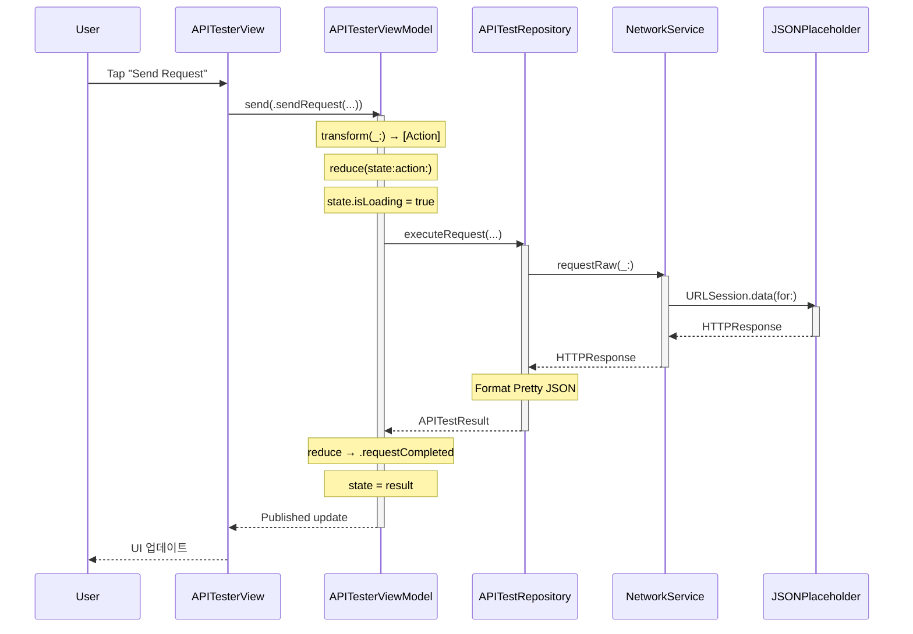

<div align="center">

# AsyncNetworkExample

### AsyncNetwork 인터랙티브 API Playground

[](https://github.com/Jimmy-Jung/AsyncNetwork)
[](https://developer.apple.com/swift)
[](https://swift.org)
[](https://tuist.io)

AsyncNetwork 사용법을 배우고 테스트할 수 있는 실전 예제 앱

</div>

---

## 개요

AsyncNetworkExample은 **JSONPlaceholder API**를 실시간으로 테스트할 수 있는 인터랙티브 Playground입니다.  
3-column NavigationSplitView 레이아웃으로 API 명세를 탐색하고, 파라미터를 입력하여 실제 네트워크 요청을 실행해볼 수 있습니다.

### 🎯 학습 목표

이 예제를 통해 다음을 배울 수 있습니다:

- ✅ **AsyncNetwork 기본 사용법**: APIRequest, NetworkService, HTTPClient
- ✅ **AsyncViewModel 패턴**: 단방향 데이터 흐름, Effect 기반 비동기 처리
- ✅ **Repository 패턴**: 의존성 주입 가능한 네트워크 추상화
- ✅ **TraceKit 로깅**: 구조화된 로그와 민감 정보 필터링
- ✅ **Tuist 프로젝트 관리**: 모듈화, 의존성 관리

## 스크린샷

### 3-Column 레이아웃

```
┌─────────────────┬──────────────────────┬─────────────────────────┐
│  Endpoints List │   API Specification  │    Try It Out           │
│  (Column 1)     │   (Column 2)         │    (Column 3)           │
├─────────────────┼──────────────────────┼─────────────────────────┤
│                 │                      │                         │
│ 🔍 Search...    │  GET /posts          │  GET /posts             │
│                 │  ━━━━━━━━━━━━━━       │  ━━━━━━━━━━━━━━         │
│ Posts ▼         │                      │                         │
│  GET /posts     │  Description:        │  Request                │
│  GET /posts/{id}│  Retrieve a list of  │  ┌───────────────────┐  │
│  POST /posts    │  all posts from      │  │ userId: 1         │  │
│  PUT /posts/{id}│  JSONPlaceholder.    │  └───────────────────┘  │
│  DELETE /posts  │                      │  ┌───────────────────┐  │
│                 │  Parameters:         │  │ [Send Request]    │  │
│ Users ▼         │  • userId (query)    │  └───────────────────┘  │
│  GET /users     │    integer, optional │                         │
│  GET /users/{id}│    Filter by user ID │  Response               │
│  POST /users    │    Example: "1"      │  ┌───────────────────┐  │
│                 │                      │  │ 200 OK            │  │
│ Comments ▼      │  Responses:          │  │                   │  │
│  GET /comments  │  • 200 OK            │  │ [{              │  │
│  GET /posts/{id}│    Array<Post>       │  │   "id": 1,        │  │
│      /comments  │    [...JSON...]      │  │   "title": "..."  │  │
│                 │                      │  │ }]                │  │
│ Todos ▼         │                      │  └───────────────────┘  │
│  GET /todos     │                      │                         │
│  GET /todos/{id}│                      │                         │
└─────────────────┴──────────────────────┴─────────────────────────┘
```

> 💡 **실제 스크린샷 추가 권장**: README에 앱 실행 화면을 추가하면 사용자 이해도가 크게 향상됩니다.

## 주요 기능

### 📱 3-Column NavigationSplitView

- **Column 1 (Endpoints List)**: API 엔드포인트 목록 및 실시간 검색
- **Column 2 (API Spec)**: OpenAPI 스타일 명세 (Parameters, Request Body, Responses)
- **Column 3 (Try It Out)**: 실제 API 테스트 UI + 응답 표시

### 🔍 API Endpoints (JSONPlaceholder)

#### Posts (게시글)
- `GET /posts` - 모든 게시글 조회
- `GET /posts/{id}` - 특정 게시글 조회
- `POST /posts` - 새 게시글 생성
- `PUT /posts/{id}` - 게시글 수정
- `DELETE /posts/{id}` - 게시글 삭제

#### Users (사용자)
- `GET /users` - 모든 사용자 조회
- `GET /users/{id}` - 특정 사용자 조회
- `POST /users` - 새 사용자 생성

#### Comments (댓글)
- `GET /comments` - 모든 댓글 조회
- `GET /posts/{postId}/comments` - 게시글별 댓글 조회

#### Todos (할 일)
- `GET /todos` - 모든 할 일 조회
- `GET /todos/{id}` - 특정 할 일 조회

### 🧠 AsyncViewModel 패턴

**Input → Action → State** 단방향 데이터 흐름:

```swift
@AsyncViewModel
final class APITesterViewModel: ObservableObject {
    enum Input {
        case sendRequest(endpoint: APIEndpoint, parameters: [String: String], body: String?)
        case clearResponse
        case saveState(endpointID: String)
        case restoreState(endpointID: String)
    }
    
    enum Action {
        case performRequest(endpoint: APIEndpoint, parameters: [String: String], body: String?)
        case requestCompleted(APITestResult)
        case requestFailed(String)
        // ...
    }
    
    struct State: Equatable, Sendable {
        var isLoading = false
        var statusCode: Int?
        var responseBody: String?
        var responseHeaders: String?
        var errorMessage: String?
    }
    
    // State 캐싱 (엔드포인트별)
    private static var responseCache: [String: State] = [:]
}
```

#### 주요 특징
- ✅ **State 캐싱**: 엔드포인트별로 마지막 응답 저장 (탭 전환 시 유지)
- ✅ **AsyncEffect**: 비동기 작업을 `.runCatchingError`로 안전하게 래핑
- ✅ **타입 안전성**: Sendable 프로토콜 완벽 준수 (Swift 6.0)
- ✅ **테스트 가능성**: 순수 함수형 Reducer

### 📊 TraceKit 로깅 통합

#### AsyncNetwork 로깅

```swift
// TraceKitNetworkLogger: AsyncNetwork의 로그를 TraceKit으로 전달
let logger = TraceKitNetworkLogger(
    minimumLevel: .verbose,
    sensitiveKeys: ["password", "token", "key", "secret"]
)

let networkService = NetworkService(
    httpClient: HTTPClient(logger: logger),
    // ...
)
```

#### AsyncViewModel 로깅

```swift
// ViewModelLoggerBuilder로 AsyncViewModel 로그 설정
ViewModelLoggerBuilder()
    .addLogger(TraceKitViewModelLogger())
    .withFormat(.compact)
    .withMinimumLevel(.verbose)
    .withStateDiffOnly(true)
    .withGroupEffects(true)
    .buildAsShared()
```

#### 로그 출력 예시

```
[TRACE] [Network] ▶️ Request: GET https://jsonplaceholder.typicode.com/posts
[TRACE] [Network] ◀️ Response: 200 OK (1.23s)
[TRACE] [ViewModel] 🎬 Action: performRequest
[TRACE] [ViewModel] 📦 State Changed: isLoading = true
[TRACE] [ViewModel] 🎬 Action: requestCompleted
[TRACE] [ViewModel] 📦 State Changed: statusCode = 200, responseBody = "..."
```

### 🏗️ Repository 패턴

**의존성 주입 가능한 추상화:**

```swift
protocol APITestRepository: Sendable {
    func executeRequest(
        endpoint: APIEndpoint,
        parameters: [String: String],
        body: String?
    ) async throws -> APITestResult
}

struct DefaultAPITestRepository: APITestRepository {
    private let networkService: NetworkService
    
    func executeRequest(...) async throws -> APITestResult {
        // DynamicAPIRequest로 동적 요청 생성
        // NetworkService를 통해 실행
        // 응답 포맷팅 (Pretty JSON)
    }
}
```

#### 테스트 시 Mock 구현체 주입 가능

```swift
struct MockAPITestRepository: APITestRepository {
    func executeRequest(...) async throws -> APITestResult {
        // 테스트용 가짜 응답 반환
    }
}
```

## 시작하기

### 필수 요구사항

- iOS 17.0+
- Xcode 16.0+
- Swift 6.0+
- Tuist (최신 버전)

### 1. 의존성 가져오기

```bash
# AsyncNetworkExample 폴더로 이동
cd Projects/AsyncNetworkExample

# Tuist 의존성 가져오기
tuist install
```

### 2. 프로젝트 생성

```bash
tuist generate
```

### 3. Xcode로 열기

```bash
open AsyncNetworkExample.xcworkspace
```

### 4. 실행

- Scheme: **AsyncNetworkExample**
- Destination: iOS Simulator (iPhone 16 Pro 권장)
- Run (⌘R)

## 프로젝트 구조

```
AsyncNetworkExample/
├── Tuist.swift                           # Tuist 전역 설정
├── Project.swift                         # Tuist 프로젝트 정의
├── Tuist/
│   ├── Package.swift                     # 의존성 (AsyncNetwork, AsyncViewModel, TraceKit)
│   ├── Package.resolved                  # 의존성 lock 파일
│   └── ProjectDescriptionHelpers/        # Helper 함수
│       ├── Scheme+Templates.swift
│       └── Settings+Templates.swift
└── AsyncNetworkExample/
    ├── Sources/
    │   ├── App/
    │   │   ├── AsyncNetworkExampleApp.swift     # @main, TraceKit/AsyncViewModel 초기화
    │   │   └── RootView.swift                 # 3-Column NavigationSplitView
    │   │
    │   ├── Features/
    │   │   ├── EndpointsList/
    │   │   │   └── EndpointsListView.swift    # Column 1: API 목록 + 검색
    │   │   ├── APISpec/
    │   │   │   └── APISpecView.swift          # Column 2: API 명세 (OpenAPI 스타일)
    │   │   └── APITester/
    │   │       └── APITesterView.swift        # Column 3: 실제 테스트 UI
    │   │
    │   ├── ViewModels/
    │   │   └── APITesterViewModel.swift       # AsyncViewModel (State 캐싱 포함)
    │   │
    │   ├── Repositories/
    │   │   └── APITestRepository.swift        # Repository 계층 (DI 가능)
    │   │       - APITestRepository (protocol)
    │   │       - DefaultAPITestRepository (구현체)
    │   │       - DynamicAPIRequest (동적 요청)
    │   │
    │   ├── Models/
    │   │   ├── APIEndpoint.swift              # API 엔드포인트 정의
    │   │   ├── APIParameter.swift             # 파라미터 모델
    │   │   ├── APIResponse.swift              # 응답 스펙
    │   │   └── RequestBody.swift              # 요청 바디 스펙
    │   │
    │   ├── Data/
    │   │   └── APIEndpointsData.swift         # JSONPlaceholder API 정의
    │   │       - Posts: GET, POST, PUT, DELETE
    │   │       - Users: GET, POST
    │   │       - Comments: GET
    │   │       - Todos: GET
    │   │
    │   └── Logger/
    │       ├── TraceKitNetworkLogger.swift    # AsyncNetwork → TraceKit 연동
    │       └── TraceKitViewModelLogger.swift  # AsyncViewModel → TraceKit 연동
    │
    ├── Resources/                        # Assets
    └── Tests/                            # 테스트
```

## Tuist 명령어

```bash
# 의존성 가져오기
tuist install

# 프로젝트 생성
tuist generate

# 빌드
tuist build AsyncNetworkExample

# 테스트
tuist test AsyncNetworkExample

# 정리
tuist clean
```

## 기술 스택

### UI Framework
- **SwiftUI** (iOS 17.0+)
- **NavigationSplitView** (3-column 레이아웃)
- **@Observable**, **@State**, **@Binding**

### Networking
- **AsyncNetwork** (로컬 패키지 `../../../`)
- **JSONPlaceholder** (https://jsonplaceholder.typicode.com)

### State Management
- **AsyncViewModel** 1.2.0+ (GitHub)
  - Input → Action → State 단방향 흐름
  - AsyncEffect 기반 비동기 처리
  - Sendable 완벽 준수

### Logging
- **TraceKit** 1.1.2+ (GitHub)
  - OSLog 백엔드
  - 구조화된 로깅
  - 민감 정보 자동 필터링

### Project Management
- **Tuist** (프로젝트 생성 및 의존성 관리)
- **ProjectDescriptionHelpers** (재사용 가능한 설정)

### Language & Platform
- **Swift 6.0** (Strict Concurrency)
- **iOS 17.0+**
- **Xcode 16.0+**

## 아키텍처

### 계층 구조

```
┌────────────────────────────────────────┐
│         Presentation Layer             │  SwiftUI Views
│  (RootView, EndpointsListView, etc.)   │
└───────────────┬────────────────────────┘
                │
┌───────────────▼────────────────────────┐
│         ViewModel Layer                │  AsyncViewModel
│      (APITesterViewModel)              │
└───────────────┬────────────────────────┘
                │
┌───────────────▼────────────────────────┐
│        Repository Layer                │  Repository 패턴
│      (APITestRepository)               │
└───────────────┬────────────────────────┘
                │
┌───────────────▼────────────────────────┐
│        AsyncNetwork Layer                │  NetworkService
│      (NetworkService, HTTPClient)      │
└───────────────┬────────────────────────┘
                │
┌───────────────▼────────────────────────┐
│         Foundation Layer               │  URLSession
│         (URLSession, Codable)          │
└────────────────────────────────────────┘
```

### 데이터 흐름 (시퀀스)



## 샘플 코드

### API 엔드포인트 정의

```swift
// Data/APIEndpointsData.swift
extension APIEndpoint {
    static let getPosts = APIEndpoint(
        id: "get-posts",
        category: "Posts",
        method: .get,
        path: "/posts",
        summary: "Get all posts",
        description: "Retrieve a list of all posts from JSONPlaceholder.",
        parameters: [
            APIParameter(
                name: "userId",
                location: .query,
                type: "integer",
                description: "Filter posts by user ID",
                example: "1"
            )
        ],
        responses: [
            APIResponse(
                statusCode: 200,
                description: "Successful response",
                schema: "Array<Post>",
                example: """
                [
                  {
                    "userId": 1,
                    "id": 1,
                    "title": "sunt aut facere repellat",
                    "body": "quia et suscipit..."
                  }
                ]
                """
            )
        ]
    )
}
```

### NetworkService 생성 (App 초기화)

```swift
// App/AsyncNetworkExampleApp.swift
@main
struct AsyncNetworkExampleApp: App {
    let repository: APITestRepository
    
    init() {
        // TraceKit 로거 생성
        let logger = TraceKitNetworkLogger(
            minimumLevel: .verbose,
            sensitiveKeys: ["password", "token", "key", "secret"]
        )
        
        // ResponseProcessor 설정
        let processor = ResponseProcessor(
            steps: [StatusCodeValidationStep()]
        )
        
        // NetworkService 생성
        let networkService = NetworkService(
            httpClient: HTTPClient(logger: logger),
            retryPolicy: .default,
            configuration: .development,
            responseProcessor: processor
        )
        
        // Repository 생성
        self.repository = DefaultAPITestRepository(networkService: networkService)
    }
}
```

## 확장 가능성

### 새로운 API 엔드포인트 추가

1. `Data/APIEndpointsData.swift`에 엔드포인트 정의 추가
2. 자동으로 UI에 반영됨 (코드 변경 불필요)

### 다른 API 서버 테스트

```swift
// baseURL 파라미터 변경
static let customAPI = APIEndpoint(
    id: "custom-api",
    category: "Custom",
    method: .get,
    path: "/endpoint",
    summary: "My Custom API",
    description: "...",
    baseURL: "https://api.example.com"  // 다른 서버 URL
)
```

### 커스텀 로거 통합

```swift
// Logger/CustomNetworkLogger.swift
struct CustomNetworkLogger: NetworkLogger {
    var options: NetworkLoggingOptions
    
    func logRequest(_ request: URLRequest, target: (any APIRequest)?) {
        // 커스텀 로깅 로직
    }
    
    func logResponse(_ response: HTTPResponse, target: (any APIRequest)?) {
        // 커스텀 로깅 로직
    }
    
    func logError(_ error: Error, target: (any APIRequest)?) {
        // 커스텀 로깅 로직
    }
}
```

## 학습 가이드

### 1단계: 기본 사용법

1. 앱 실행 후 **Posts → GET /posts** 선택
2. **Send Request** 버튼 클릭
3. 응답 확인 (Status Code, Headers, Body)

### 2단계: 파라미터 사용

1. **GET /posts** 선택
2. **userId** 파라미터에 `1` 입력
3. 요청 실행 후 결과 비교

### 3단계: POST 요청

1. **POST /posts** 선택
2. Request Body에 JSON 입력:
```json
{
  "title": "My Post",
  "body": "This is a test post",
  "userId": 1
}
```
3. 요청 실행 후 201 Created 확인

### 4단계: 로그 확인

1. Xcode Console에서 TraceKit 로그 확인
2. 요청/응답 상세 정보 분석
3. 민감 정보 필터링 동작 확인

### 5단계: 코드 탐색

1. `APITesterViewModel.swift` - AsyncViewModel 패턴
2. `APITestRepository.swift` - Repository 패턴
3. `TraceKitNetworkLogger.swift` - 로거 통합

## 참고 링크

- **AsyncNetwork**: [../../../README.md](../../../README.md)
- **AsyncViewModel**: https://github.com/Jimmy-Jung/AsyncViewModel
- **TraceKit**: https://github.com/Jimmy-Jung/TraceKit
- **JSONPlaceholder**: https://jsonplaceholder.typicode.com

---

<div align="center">

**AsyncNetworkExample** - AsyncNetwork 라이브러리 사용법을 보여주는 인터랙티브 API Playground

[⬆ 맨 위로](#networkkitexample)

</div>
