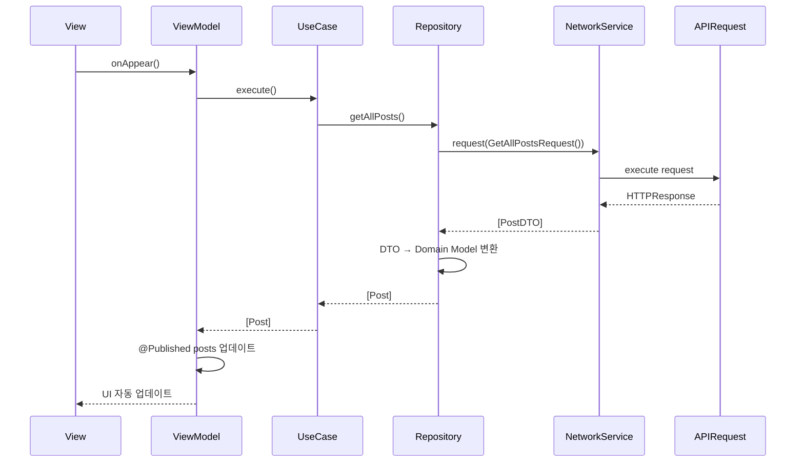
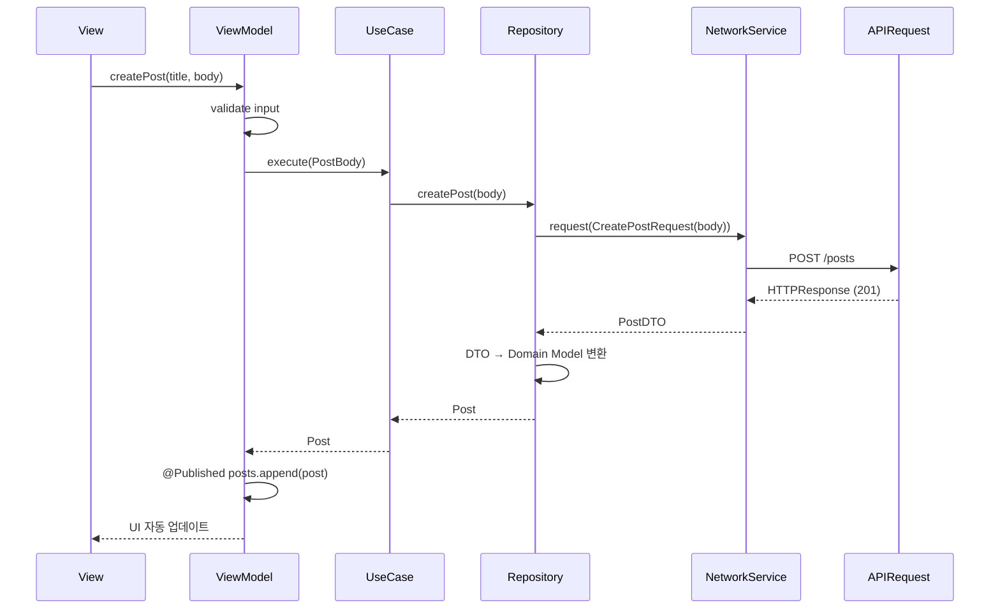

# AsyncNetworkSampleApp 아키텍처 설계

## 📋 개요

AsyncNetworkSampleApp은 AsyncNetwork 프레임워크의 주요 기능을 실제로 보여주는 iOS 샘플 앱입니다. JSONPlaceholder API를 사용하여 Posts, Users, Comments, Albums 등의 데이터를 조회하고 관리하는 기능을 제공합니다.

## 🎯 목표

1. **AsyncNetwork 기능 시연**: @APIRequest 매크로, Property Wrappers, 재시도 정책, 인터셉터 등 모든 주요 기능을 실제로 사용
2. **베스트 프랙티스 제시**: Swift Concurrency, 함수형 프로그래밍, Clean Code 원칙을 적용한 모범 사례
3. **학습 자료 제공**: 개발자가 AsyncNetwork를 학습하고 참고할 수 있는 완전한 예제

## 🏗️ 아키텍처 패턴

### MVVM (Model-View-ViewModel)

```
┌─────────────────────────────────────────────────────────────┐
│                         Presentation                         │
│  ┌──────────┐         ┌──────────────┐      ┌──────────┐   │
│  │   View   │ ◄──────► │  ViewModel   │ ◄─── │  Router  │   │
│  │(SwiftUI) │          │(@Published) │      │(Navigation)│  │
│  └──────────┘          └──────────────┘      └──────────┘   │
└─────────────────────────────────────────────────────────────┘
                              │
                              ▼
┌─────────────────────────────────────────────────────────────┐
│                          Domain                             │
│  ┌──────────────┐         ┌──────────────┐                │
│  │  Repository  │ ◄──────► │   UseCase    │                │
│  │  (Protocol)  │          │  (Business)  │                │
│  └──────────────┘          └──────────────┘                │
└─────────────────────────────────────────────────────────────┘
                              │
                              ▼
┌─────────────────────────────────────────────────────────────┐
│                           Data                              │
│  ┌──────────────┐         ┌──────────────┐                │
│  │  Repository  │ ◄──────► │  NetworkService│              │
│  │ (Implementation)│        │  (@APIRequest) │              │
│  └──────────────┘          └──────────────┘                │
└─────────────────────────────────────────────────────────────┘
```

### 레이어 분리

1. **Presentation Layer** (SwiftUI Views + ViewModels)
   - 사용자 인터페이스
   - 상태 관리 (@Published)
   - 사용자 입력 처리

2. **Domain Layer** (Business Logic)
   - Repository 프로토콜
   - UseCase (비즈니스 로직)
   - 도메인 모델

3. **Data Layer** (Network + Storage)
   - Repository 구현
   - NetworkService 사용
   - @APIRequest 정의

## 📁 프로젝트 구조

```
AsyncNetworkSampleApp/
├── App/
│   ├── AsyncNetworkSampleApp.swift      # @main 진입점
│   └── AppDependency.swift               # 의존성 주입 컨테이너
│
├── Presentation/
│   ├── Posts/
│   │   ├── PostListView.swift           # 포스트 목록 화면
│   │   ├── PostListViewModel.swift      # 포스트 목록 ViewModel
│   │   ├── PostDetailView.swift         # 포스트 상세 화면
│   │   └── PostDetailViewModel.swift    # 포스트 상세 ViewModel
│   │
│   ├── Users/
│   │   ├── UserListView.swift
│   │   ├── UserListViewModel.swift
│   │   ├── UserDetailView.swift
│   │   └── UserDetailViewModel.swift
│   │
│   ├── Comments/
│   │   ├── CommentListView.swift
│   │   └── CommentListViewModel.swift
│   │
│   ├── Albums/
│   │   ├── AlbumListView.swift
│   │   ├── AlbumListViewModel.swift
│   │   ├── PhotoGridView.swift
│   │   └── PhotoGridViewModel.swift
│   │
│   └── Common/
│       ├── NetworkStatusView.swift      # 네트워크 상태 표시
│       ├── ErrorView.swift              # 에러 표시
│       └── LoadingView.swift            # 로딩 표시
│
├── Domain/
│   ├── Models/
│   │   ├── Post.swift                   # 도메인 모델
│   │   ├── User.swift
│   │   ├── Comment.swift
│   │   ├── Album.swift
│   │   └── Photo.swift
│   │
│   ├── Repositories/
│   │   ├── PostRepository.swift        # Repository 프로토콜
│   │   ├── UserRepository.swift
│   │   ├── CommentRepository.swift
│   │   └── AlbumRepository.swift
│   │
│   └── UseCases/
│       ├── GetPostsUseCase.swift        # 비즈니스 로직
│       ├── GetPostByIdUseCase.swift
│       ├── CreatePostUseCase.swift
│       └── DeletePostUseCase.swift
│
├── Data/
│   ├── Repositories/
│   │   ├── PostRepositoryImpl.swift     # Repository 구현
│   │   ├── UserRepositoryImpl.swift
│   │   ├── CommentRepositoryImpl.swift
│   │   └── AlbumRepositoryImpl.swift
│   │
│   ├── API/
│   │   ├── Requests/
│   │   │   ├── PostRequests.swift      # @APIRequest 정의
│   │   │   ├── UserRequests.swift
│   │   │   ├── CommentRequests.swift
│   │   │   └── AlbumRequests.swift
│   │   │
│   │   └── Models/
│   │       ├── PostDTO.swift            # DTO (Data Transfer Object)
│   │       ├── UserDTO.swift
│   │       ├── CommentDTO.swift
│   │       └── AlbumDTO.swift
│   │
│   └── Network/
│       ├── NetworkServiceFactory.swift  # NetworkService 생성
│       ├── AuthInterceptor.swift        # 인증 인터셉터 (예제)
│       └── CustomRetryRule.swift        # 커스텀 재시도 규칙
│
└── Resources/
    ├── Assets.xcassets/
    └── Localizable.strings
```

## 🔄 데이터 흐름

### 1. 포스트 목록 조회 예시



### 2. 포스트 생성 예시



## 🎨 주요 기능

### 1. 포스트 관리
- ✅ 포스트 목록 조회 (페이지네이션)
- ✅ 포스트 상세 조회
- ✅ 포스트 생성
- ✅ 포스트 수정
- ✅ 포스트 삭제
- ✅ 사용자별 포스트 필터링

### 2. 사용자 관리
- ✅ 사용자 목록 조회
- ✅ 사용자 상세 조회 (주소, 회사 정보 포함)
- ✅ 사용자 생성

### 3. 댓글 관리
- ✅ 포스트별 댓글 조회
- ✅ 댓글 생성

### 4. 앨범 및 사진
- ✅ 사용자별 앨범 목록
- ✅ 앨범별 사진 그리드 뷰
- ✅ 이미지 로딩 (AsyncImage)

### 5. 네트워크 상태 모니터링
- ✅ 실시간 네트워크 연결 상태 표시
- ✅ 오프라인 상태 감지 및 처리
- ✅ 네트워크 복구 시 자동 재시도

### 6. 에러 처리
- ✅ 네트워크 에러 처리
- ✅ HTTP 상태 코드 에러 처리
- ✅ 사용자 친화적 에러 메시지

## 🛠️ 기술 스택

### 프레임워크
- **SwiftUI**: UI 프레임워크
- **AsyncNetwork**: 네트워크 라이브러리
- **Swift Concurrency**: async/await, Task, Actor

### 아키텍처 패턴
- **MVVM**: View-ViewModel 분리
- **Repository Pattern**: 데이터 접근 추상화
- **UseCase Pattern**: 비즈니스 로직 캡슐화
- **Dependency Injection**: 의존성 주입

### 설계 원칙
- **Clean Code**: 함수형 프로그래밍, 순수 함수, 불변성
- **SOLID 원칙**: 단일 책임, 의존성 역전
- **DRY**: 코드 중복 최소화

## 📝 구현 가이드

### 1. ViewModel 구현 패턴

```swift
@MainActor
final class PostListViewModel: ObservableObject {
    @Published private(set) var posts: [Post] = []
    @Published private(set) var isLoading = false
    @Published private(set) var errorMessage: String?
    
    private let getPostsUseCase: GetPostsUseCase
    
    init(getPostsUseCase: GetPostsUseCase) {
        self.getPostsUseCase = getPostsUseCase
    }
    
    func loadPosts() async {
        isLoading = true
        errorMessage = nil
        
        do {
            posts = try await getPostsUseCase.execute()
        } catch {
            errorMessage = error.localizedDescription
        }
        
        isLoading = false
    }
}
```

### 2. Repository 구현 패턴

```swift
final class PostRepositoryImpl: PostRepository {
    private let networkService: NetworkService
    
    init(networkService: NetworkService) {
        self.networkService = networkService
    }
    
    func getAllPosts() async throws -> [Post] {
        let dtos: [PostDTO] = try await networkService.request(GetAllPostsRequest())
        return dtos.map(Post.init)
    }
    
    func getPost(by id: Int) async throws -> Post {
        let dto: PostDTO = try await networkService.request(GetPostByIdRequest(id: id))
        return Post(dto: dto)
    }
    
    func createPost(_ body: PostBody) async throws -> Post {
        let dto: PostDTO = try await networkService.request(
            CreatePostRequest(body: body)
        )
        return Post(dto: dto)
    }
}
```

### 3. UseCase 구현 패턴

```swift
struct GetPostsUseCase {
    private let repository: PostRepository
    
    init(repository: PostRepository) {
        self.repository = repository
    }
    
    func execute() async throws -> [Post] {
        try await repository.getAllPosts()
    }
}
```

### 4. APIRequest 정의 패턴

```swift
@APIRequest(
    response: [PostDTO].self,
    title: "Get all posts",
    description: "JSONPlaceholder에서 모든 포스트를 가져옵니다.",
    baseURL: "https://jsonplaceholder.typicode.com",
    path: "/posts",
    method: .get,
    tags: ["Posts", "Read"]
)
struct GetAllPostsRequest {
    @QueryParameter var userId: Int?
    @QueryParameter(key: "_limit") var limit: Int?
}
```

## 🔌 AsyncNetwork 기능 활용

### 1. Property Wrappers
- `@QueryParameter`: 쿼리 파라미터
- `@PathParameter`: 경로 파라미터
- `@RequestBody`: 요청 본문
- `@HeaderField`: 표준 HTTP 헤더
- `@CustomHeader`: 커스텀 헤더

### 2. RequestInterceptor
- `AuthInterceptor`: 인증 토큰 자동 추가 (예제)
- `ConsoleLoggingInterceptor`: 네트워크 로깅

### 3. RetryPolicy
- 커스텀 재시도 규칙
- 지수 백오프 전략
- 서버 에러 재시도

### 4. NetworkMonitor
- 실시간 네트워크 상태 감지
- 오프라인 상태 처리
- 연결 타입 확인 (Wi-Fi, Cellular)

## 🧪 테스트 전략

### 1. Unit Tests
- ViewModel 로직 테스트
- UseCase 테스트
- Repository 테스트 (Mock NetworkService)

### 2. Integration Tests
- NetworkService + MockURLProtocol
- 전체 데이터 흐름 테스트

### 3. UI Tests
- 주요 사용자 시나리오 테스트

## 📊 성능 최적화

1. **이미지 캐싱**: AsyncImage + URLCache
2. **페이지네이션**: 무한 스크롤
3. **Lazy Loading**: 필요할 때만 데이터 로드
4. **메모리 관리**: @MainActor, weak self

## 🚀 향후 확장 가능성

1. **오프라인 지원**: Core Data 캐싱
2. **검색 기능**: 로컬 검색 + 서버 검색
3. **즐겨찾기**: UserDefaults 저장
4. **다크 모드**: 완전 지원
5. **접근성**: VoiceOver, Dynamic Type 지원

## 📚 참고 자료

- [AsyncNetwork README](../../README.md)
- [AsyncNetwork 사용 가이드](../../.cursor/rules/spec/asynchnetwork/RULE.mdc)
- [Swift 함수형 프로그래밍 가이드](../../.cursor/rules/spec/swift-functional/RULE.mdc)
- [iOS 개발 계획 가이드](../../.cursor/rules/core/development-planning/RULE.mdc)

