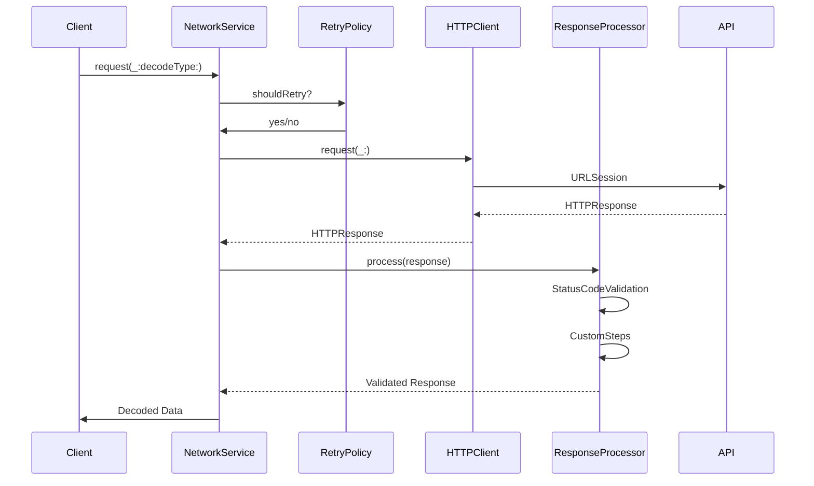

<div align="center">

# AsyncNetwork

### 순수 Foundation 기반의 Swift 네트워크 라이브러리

[](https://swift.org)
[](https://developer.apple.com/swift)
[](LICENSE)
[](https://github.com/Jimmy-Jung/AsyncNetwork/releases)
[](https://github.com/Jimmy-Jung/AsyncNetwork/actions/workflows/ci.yml)
[](https://swift.org/package-manager)

[English](#) | [한국어](#-korean)

</div>

---

## 왜 AsyncNetwork인가?

AsyncNetwork은 순수 Foundation만을 사용하여 구축된 현대적인 Swift 네트워크 라이브러리입니다.

### 주요 특징

- ✅ **순수 Foundation**: URLSession, Codable, async/await만 사용 (외부 의존성 제로)
- ⚡ **Swift Concurrency 네이티브**: async/await 완벽 지원
- 🧱 **책임별 모듈 구조**: 명확한 단일 책임 원칙 (Models, Client, Service 등)
- 🔄 **재시도 정책**: 유연한 재시도 전략 (지수 백오프, 커스텀 규칙)
- 🔗 **Chain of Responsibility 패턴**: 확장 가능한 응답 처리 파이프라인
- 🔌 **RequestInterceptor**: 프로토콜 기반 요청/응답 인터셉터 (로깅, 인증 등)
- 🧪 **테스트 용이성**: MockURLProtocol 기반 단위 테스트 지원
- 🎯 **타입 안전성**: Sendable 완벽 준수 (Swift 6.0 Strict Concurrency)
- 🏷️ **타입 추론**: associatedtype Response로 간결한 API 호출
- 📦 **SPM 패키지**: Swift Package Manager로 간편 설치

### 다른 라이브러리와 비교

| 특징 | AsyncNetwork | Alamofire | Moya |
|------|-----------|-----------|------|
| 외부 의존성 | ✅ 없음 | ❌ AFNetworking | ❌ Alamofire |
| Swift Concurrency | ✅ 네이티브 | ✅ 지원 | ⚠️ 부분 지원 |
| 모듈 구조 | ✅ 책임별 분리 | ⚠️ 단일 계층 | ✅ 계층화 |
| 재시도 정책 | ✅ 내장 | ✅ 내장 | ⚠️ 플러그인 |
| 코드 크기 | 🟢 작음 | 🟡 중간 | 🟡 중간 |
| 학습 곡선 | ⭐⭐ 보통 | ⭐ 쉬움 | ⭐⭐ 보통 |

### 누가 사용하면 좋을까요?

- ✅ 외부 의존성 없이 순수 Foundation만 사용하고 싶은 팀
- ✅ Swift Concurrency를 활용한 현대적인 네트워크 코드를 원하는 개발자
- ✅ 명확한 책임 분리로 확장 가능한 네트워크 레이어를 구축하려는 프로젝트
- ✅ 재시도 정책과 에러 처리를 세밀하게 제어하고 싶은 경우
- ✅ 테스트 가능한 네트워크 코드를 작성하려는 팀

## 목차

- [왜 AsyncNetwork인가?](#왜-networkkit인가)
- [빠른 시작](#빠른-시작)
- [설치](#설치)
- [핵심 개념](#핵심-개념)
- [아키텍처](#아키텍처)
- [기본 사용법](#기본-사용법)
- [고급 기능](#고급-기능)
- [Example 앱](#example-앱)
- [테스트](#테스트)
- [문서](#문서)
- [기여하기](#기여하기)
- [라이선스](#라이선스)

## 빠른 시작

### 1. Response 모델 정의

```swift
import AsyncNetwork

struct User: Codable, Sendable {
    let id: Int
    let name: String
    let email: String
}
```

### 2. API Request 정의 (타입 안전)

```swift
enum MyAPI {
    case getUsers
    case getUser(id: Int)
    case createUser(name: String)
    case logout
}

extension MyAPI: APIRequest {
    // 🎯 associatedtype으로 응답 타입 지정 (타입 추론 가능)
    typealias Response = User
    
    var baseURL: URL {
        URL(string: "https://api.example.com")!
    }
    
    var path: String {
        switch self {
        case .getUsers:
            return "/users"
        case .getUser(let id):
            return "/users/\(id)"
        case .createUser:
            return "/users"
        case .logout:
            return "/auth/logout"
        }
    }
    
    var method: HTTPMethod {
        switch self {
        case .getUsers, .getUser:
            return .get
        case .createUser:
            return .post
        case .logout:
            return .post
        }
    }
    
    var task: HTTPTask {
        switch self {
        case .getUsers, .getUser, .logout:
            return .requestPlain
        case .createUser(let name):
            struct CreateUserBody: Encodable, Sendable {
                let name: String
            }
            return .requestJSONEncodable(CreateUserBody(name: name))
        }
    }
    
    var headers: [String: String]? {
        ["Content-Type": "application/json"]
    }
}
```

빈 응답이 필요한 경우:

```swift
struct LogoutRequest: APIRequest {
    typealias Response = EmptyResponse  // 빈 응답 타입
    
    var baseURL: URL { URL(string: "https://api.example.com")! }
    var path: String { "/auth/logout" }
    var method: HTTPMethod { .post }
    var task: HTTPTask { .requestPlain }
}
```

### 3. NetworkService 사용

```swift
import AsyncNetwork

// NetworkService 생성 (Factory 사용)
let networkService = AsyncNetwork.createNetworkService(
    interceptors: [ConsoleLoggingInterceptor()],
    configuration: .development
)

// 방법 1️⃣: associatedtype Response 타입 추론 (권장 ⭐)
do {
    let user = try await networkService.request(MyAPI.getUser(id: 1))
    print("User: \(user)")  // User 타입이 자동으로 추론됨
} catch {
    print("Error: \(error)")
}

// 방법 2️⃣: 명시적 타입 지정 (유연성 필요 시)
do {
    let users = try await networkService.request(
        request: MyAPI.getUsers,
        decodeType: [User].self  // 배열 타입으로 명시
    )
    print("Users: \(users)")
} catch {
    print("Error: \(error)")
}

// 방법 3️⃣: 빈 응답 처리
do {
    let emptyResponse = try await networkService.request(LogoutRequest())
    print("Logout success")  // EmptyResponse 반환
} catch {
    print("Error: \(error)")
}
```

## 설치

### 요구사항

| 플랫폼 | 최소 버전 |
|--------|----------|
| iOS | 13.0+ |
| macOS | 10.15+ |
| tvOS | 13.0+ |
| watchOS | 6.0+ |
| Swift | 6.0+ |
| Xcode | 16.0+ |

### Swift Package Manager

#### Package.swift에 추가

```swift
dependencies: [
    .package(url: "https://github.com/Jimmy-Jung/AsyncNetwork.git", from: "1.0.0")
]
```

**타겟 의존성 추가:**

```swift
.target(
    name: "YourTarget",
    dependencies: [
        .product(name: "AsyncNetwork", package: "AsyncNetwork")
    ]
)
```

#### Xcode에서 추가

1. **File → Add Package Dependencies...**
2. 검색창에 입력: `https://github.com/Jimmy-Jung/AsyncNetwork.git`
3. **Add Package** 클릭
4. **`AsyncNetwork`** 선택

## 핵심 개념

AsyncNetwork은 **책임별 모듈 구조**로 설계되었습니다:

```
┌──────────────────────────────────────┐
│      Service                          │  NetworkService (오케스트레이터)
│      (네트워크 요청 조율)              │
└──────────────┬───────────────────────┘
               │
┌──────────────▼───────────────────────┐
│      Processing                       │  ResponseProcessor, ResponseDecoder
│      (응답 처리 파이프라인)            │  StatusCodeValidator
└──────────────┬───────────────────────┘
               │
┌──────────────▼───────────────────────┐
│      Client                           │  HTTPClient (HTTP 통신)
│      (HTTP 통신 클라이언트)            │  HTTPHeaders
└──────────────┬───────────────────────┘
               │
┌──────────────▼───────────────────────┐
│      Models + Protocols               │  APIRequest, HTTPMethod, HTTPTask
│      (핵심 타입 및 인터페이스)         │  RequestInterceptor, RetryRule
└──────────────────────────────────────┘
               │
┌──────────────▼───────────────────────┐
│      Configuration + Errors           │  NetworkConfiguration, RetryPolicy
│      (정책 및 에러 처리)               │  ErrorMapper
└──────────────────────────────────────┘
```

### 주요 컴포넌트

| 컴포넌트 | 역할 | 위치 |
|---------|------|------|
| **APIRequest** | API 엔드포인트 정의 프로토콜 | Protocols |
| **HTTPClient** | URLSession 기반 HTTP 클라이언트 | Client |
| **NetworkService** | 네트워크 요청 오케스트레이터 | Service |
| **RetryPolicy** | 재시도 정책 | Configuration |
| **ResponseProcessor** | Chain of Responsibility 응답 처리 | Processing |
| **RequestInterceptor** | 요청/응답 인터셉터 프로토콜 | Protocols |
| **ConsoleLoggingInterceptor** | 콘솔 로깅 구현체 | Interceptors |

## 아키텍처

### 책임별 모듈 구조

AsyncNetwork은 단일 책임 원칙에 따라 9개의 명확한 모듈로 구성되어 있습니다:

#### 1️⃣ Models (도메인 모델)

HTTP 관련 기본 타입 정의:

- `HTTPMethod`: HTTP 메서드 (GET, POST, PUT, DELETE 등)
- `HTTPResponse`: HTTP 응답 래퍼
- `HTTPTask`: 요청 타입 (Plain, Data, JSONEncodable, Parameters)
- `ServerResponse`: 서버 응답 제네릭 래퍼

#### 2️⃣ Protocols (인터페이스)

확장 가능한 프로토콜 정의:

- `APIRequest`: API 엔드포인트 프로토콜
- `RequestInterceptor`: 요청/응답 인터셉터 프로토콜
- `ResponseProcessorStep`: 응답 처리 단계 프로토콜
- `RetryRule`: 재시도 규칙 프로토콜

#### 3️⃣ Configuration (설정 및 정책)

네트워크 설정과 정책:

- `NetworkConfiguration`: 네트워크 설정 (타임아웃, 재시도, 로깅)
- `RetryPolicy`: 재시도 전략 (지수 백오프, Rule 기반 판단)

#### 4️⃣ Client (HTTP 통신)

순수 HTTP 통신 클라이언트:

- `HTTPClient`: URLSession 기반 HTTP 클라이언트
- `HTTPHeaders`: HTTP 헤더 빌더 (메서드 체이닝)

#### 5️⃣ Interceptors (인터셉터)

요청/응답 인터셉터 구현체:

- `ConsoleLoggingInterceptor`: 콘솔 로깅 (민감 정보 필터링)

#### 6️⃣ Processing (응답 처리)

응답 처리 파이프라인:

- `ResponseProcessor`: Chain of Responsibility 패턴 응답 처리
- `ResponseDecoder`: JSON 디코딩
- `StatusCodeValidator`: HTTP 상태 코드 검증

#### 7️⃣ Service (네트워크 서비스)

컴포넌트 오케스트레이터:

- `NetworkService`: 요청 실행, 재시도, 인터셉터 체이닝

#### 8️⃣ Errors (에러 처리)

에러 변환 및 매핑:

- `ErrorMapper`: 다양한 에러를 통합 NetworkError로 변환

#### 9️⃣ Utilities (유틸리티)

공통 헬퍼:

- `AsyncDelayer`: 비동기 지연 처리 (테스트 가능)

### 데이터 흐름



## 기본 사용법

### NetworkService Factory

간편하게 NetworkService를 생성합니다:

```swift
import AsyncNetwork

// 기본 설정 (Console Logging)
let service = AsyncNetwork.createNetworkService()

// 커스텀 Interceptors + 환경 설정
let service = AsyncNetwork.createNetworkService(
    interceptors: [
        ConsoleLoggingInterceptor(minimumLevel: .verbose),
        AuthInterceptor()
    ],
    configuration: .development
)

// 로깅 없이 (빈 Interceptors)
let service = AsyncNetwork.createNetworkService(
    interceptors: [],
    configuration: .production
)
```

### APIRequest 프로토콜

```swift
public protocol APIRequest: Sendable {
    /// 🎯 응답 타입 (associatedtype)
    /// - 기본값: EmptyResponse (빈 응답)
    /// - 사용 예: typealias Response = User
    associatedtype Response: Decodable & Sendable = EmptyResponse
    
    var baseURL: URL { get }
    var path: String { get }
    var method: HTTPMethod { get }
    var task: HTTPTask { get }
    var headers: [String: String]? { get }
    var timeout: TimeInterval { get }
}

public extension APIRequest {
    var timeout: TimeInterval { 30.0 }  // 기본 타임아웃: 30초
    var headers: [String: String]? { nil }  // 기본 헤더: nil
}
```

**사용 예시:**

```swift
// 1️⃣ 단일 객체 응답
struct GetUserRequest: APIRequest {
    typealias Response = User  // User 타입 지정
    let userId: Int
    
    var baseURL: URL { URL(string: "https://api.example.com")! }
    var path: String { "/users/\(userId)" }
    var method: HTTPMethod { .get }
    var task: HTTPTask { .requestPlain }
}

// 사용: 타입 추론으로 간결하게
let user = try await networkService.request(GetUserRequest(userId: 1))

// 2️⃣ 배열 응답
struct GetUsersRequest: APIRequest {
    typealias Response = [User]  // 배열 타입 지정
    
    var baseURL: URL { URL(string: "https://api.example.com")! }
    var path: String { "/users" }
    var method: HTTPMethod { .get }
    var task: HTTPTask { .requestPlain }
}

// 사용
let users = try await networkService.request(GetUsersRequest())

// 3️⃣ 빈 응답 (204 No Content 등)
struct DeleteUserRequest: APIRequest {
    typealias Response = EmptyResponse  // 빈 응답
    let userId: Int
    
    var baseURL: URL { URL(string: "https://api.example.com")! }
    var path: String { "/users/\(userId)" }
    var method: HTTPMethod { .delete }
    var task: HTTPTask { .requestPlain }
}

// 사용
try await networkService.request(DeleteUserRequest(userId: 1))
```

### HTTPTask 타입

```swift
public enum HTTPTask: Sendable {
    case requestPlain                                           // 파라미터 없음
    case requestData(Data)                                      // Raw Data
    case requestJSONEncodable(any Encodable & Sendable)         // JSON Body
    case requestParameters(parameters: [String: String])        // Form 파라미터
    case requestQueryParameters(parameters: [String: String])   // Query 파라미터
}
```

### 재시도 정책

```swift
// Preset 사용
let service1 = AsyncNetwork.createNetworkService(
    configuration: .default  // maxRetries: 3, baseDelay: 1.0
)

let service2 = AsyncNetwork.createNetworkService(
    configuration: .aggressive  // maxRetries: 5, baseDelay: 0.5
)

// 커스텀 설정
let customConfig = NetworkConfiguration(
    maxRetries: 3,
    retryDelay: 1.0,
    timeout: 30.0,
    enableLogging: true
)

let customRetryPolicy = RetryPolicy(
    configuration: RetryConfiguration(
        maxRetries: 3,
        baseDelay: 1.0,
        maxDelay: 30.0
    ),
    rules: [URLErrorRetryRule(), ServerErrorRetryRule()]
)
```

### 커스텀 Logging Interceptor

```swift
struct AnalyticsInterceptor: RequestInterceptor {
    func willSend(_ request: URLRequest, target: (any APIRequest)?) async {
        // 요청 시작 Analytics
        Analytics.track("API Request", properties: [
            "url": request.url?.absoluteString ?? "",
            "method": request.httpMethod ?? ""
        ])
    }
    
    func didReceive(_ response: HTTPResponse, target: (any APIRequest)?) async {
        // 응답 Analytics
        Analytics.track("API Response", properties: [
            "url": response.url.absoluteString,
            "statusCode": response.statusCode
        ])
    }
}

// 사용
let service = AsyncNetwork.createNetworkService(
    interceptors: [AnalyticsInterceptor()],
    configuration: .production
)
```

## 고급 기능

### ResponseProcessor (Chain of Responsibility)

응답 처리 파이프라인을 커스터마이징할 수 있습니다:

```swift
struct MyAuthenticationStep: ResponseProcessorStep {
    func process(
        _ response: HTTPResponse,
        request: (any APIRequest)?
    ) -> Result<HTTPResponse, NetworkError> {
        // 401 Unauthorized 처리
        if response.statusCode == 401 {
            return .failure(.unauthorized)
        }
        return .success(response)
    }
}

struct MyRateLimitStep: ResponseProcessorStep {
    func process(
        _ response: HTTPResponse,
        request: (any APIRequest)?
    ) -> Result<HTTPResponse, NetworkError> {
        // 429 Too Many Requests 처리
        if response.statusCode == 429 {
            let retryAfter = response.headers["Retry-After"]
            return .failure(.rateLimitExceeded(retryAfter: retryAfter))
        }
        return .success(response)
    }
}

let processor = ResponseProcessor(
    steps: [
        StatusCodeValidationStep(),   // 기본 상태 코드 검증
        MyAuthenticationStep(),        // 커스텀: 인증
        MyRateLimitStep()              // 커스텀: Rate Limiting
    ]
)

let service = NetworkService(
    httpClient: HTTPClient(),
    retryPolicy: .default,
    configuration: .production,
    responseProcessor: processor,
    dataResponseProcessor: DataResponseProcessor(),
    interceptors: []
)
```

### RequestInterceptor

요청 전/후 처리:

```swift
struct AuthInterceptor: RequestInterceptor {
    func prepare(_ request: inout URLRequest, target: (any APIRequest)?) async throws {
        // 토큰 추가
        let token = try await TokenManager.shared.getToken()
        request.setValue("Bearer \(token)", forHTTPHeaderField: "Authorization")
    }
    
    func willSend(_ request: URLRequest, target: (any APIRequest)?) async {
        print("🚀 Sending: \(request.url?.absoluteString ?? "")")
    }
    
    func didReceive(_ response: HTTPResponse, target: (any APIRequest)?) async {
        print("✅ Received: \(response.statusCode)")
    }
}
```

### Form Parameters

Form 데이터 전송:

```swift
enum LoginAPI: APIRequest {
    case login(username: String, password: String)
    
    var task: HTTPTask {
        switch self {
        case .login(let username, let password):
            return .requestParameters(
                parameters: [
                    "username": username,
                    "password": password
                ]
            )
        }
    }
    
    var headers: [String: String]? {
        ["Content-Type": "application/x-www-form-urlencoded"]
    }
}
```

### Query Parameters

URL Query 파라미터:

```swift
enum SearchAPI: APIRequest {
    case search(query: String, page: Int)
    
    var task: HTTPTask {
        switch self {
        case .search(let query, let page):
            return .requestQueryParameters(
                parameters: [
                    "q": query,
                    "page": "\(page)"
                ]
            )
        }
    }
}
// 결과: GET /search?q=keyword&page=1
```

## Example 앱

AsyncNetworkExample은 JSONPlaceholder API를 테스트할 수 있는 **인터랙티브 API Playground**입니다.

### 주요 기능

- 📱 **3-Column NavigationSplitView**: API 목록 → 명세 → 테스트
- 🔍 **실시간 검색**: API 엔드포인트 빠른 검색
- 🧪 **인터랙티브 테스트**: Parameters, Request Body 입력 후 실제 요청
- 📊 **상세 응답 표시**: Status Code, Headers, Body (Pretty JSON)
- 💾 **State 캐싱**: 엔드포인트별 마지막 응답 자동 저장
- 📝 **TraceKit 로깅**: OSLog 통합 구조화 로그

### 기술 스택

- **AsyncNetwork**: 네트워크 레이어
- **AsyncViewModel**: 상태 관리 (단방향 데이터 흐름)
- **TraceKit**: 구조화된 로깅
- **Tuist**: 프로젝트 관리

### 실행 방법

```bash
cd Projects/AsyncNetworkExample

# 의존성 가져오기
tuist install

# 프로젝트 생성
tuist generate

# Xcode로 열기
open AsyncNetworkExample.xcworkspace
```

자세한 내용은 [AsyncNetworkExample README](./Projects/AsyncNetworkExample/README.md)를 참고하세요.

## 테스트

AsyncNetwork은 테스트하기 쉽게 설계되었습니다.

### MockURLProtocol 사용

```swift
import Testing
@testable import AsyncNetwork

@Test("사용자 목록 조회 성공")
func testGetUsersSuccess() async throws {
    // Given
    let mockJSON = """
    [
        {"id": 1, "name": "John"},
        {"id": 2, "name": "Jane"}
    ]
    """
    
    MockURLProtocol.requestHandler = { request in
        let response = HTTPURLResponse(
            url: request.url!,
            statusCode: 200,
            httpVersion: nil,
            headerFields: ["Content-Type": "application/json"]
        )!
        return (response, mockJSON.data(using: .utf8)!)
    }
    
    let config = URLSessionConfiguration.ephemeral
    config.protocolClasses = [MockURLProtocol.self]
    let session = URLSession(configuration: config)
    
    let client = HTTPClient(session: session)
    let service = NetworkService(httpClient: client)
    
    // When
    let users = try await service.request(
        request: MyAPI.getUsers,
        decodeType: [User].self
    )
    
    // Then
    #expect(users.count == 2)
    #expect(users[0].name == "John")
}

@Test("재시도 정책 테스트")
func testRetryPolicy() async throws {
    var attemptCount = 0
    
    MockURLProtocol.requestHandler = { request in
        attemptCount += 1
        
        if attemptCount < 3 {
            throw URLError(.timedOut)
        }
        
        let response = HTTPURLResponse(
            url: request.url!,
            statusCode: 200,
            httpVersion: nil,
            headerFields: nil
        )!
        return (response, Data())
    }
    
    let config = URLSessionConfiguration.ephemeral
    config.protocolClasses = [MockURLProtocol.self]
    let session = URLSession(configuration: config)
    
    let client = HTTPClient(session: session)
    let retryPolicy = RetryPolicy(
        configuration: RetryConfiguration(maxRetries: 3, baseDelay: 0.1)
    )
    let service = NetworkService(
        httpClient: client,
        retryPolicy: retryPolicy,
        configuration: .test,
        responseProcessor: ResponseProcessor(),
        dataResponseProcessor: DataResponseProcessor()
    )
    
    // When
    _ = try await service.requestRaw(MyAPI.getUsers)
    
    // Then
    #expect(attemptCount == 3)
}
```

## 문서

### 📚 프로젝트 구조

```
AsyncNetwork/
├── Package.swift                    # SPM 패키지 정의
├── Projects/
│   ├── AsyncNetwork/                  # Core 라이브러리
│   │   ├── Sources/
│   │   │   ├── Models/              # 도메인 모델
│   │   │   ├── Protocols/           # 인터페이스
│   │   │   ├── Configuration/       # 설정 및 정책
│   │   │   ├── Client/              # HTTP 클라이언트
│   │   │   ├── Interceptors/        # 인터셉터
│   │   │   ├── Processing/          # 응답 처리
│   │   │   ├── Service/             # 네트워크 서비스
│   │   │   ├── Errors/              # 에러 처리
│   │   │   ├── Utilities/           # 유틸리티
│   │   │   └── AsyncNetwork.swift     # 공개 진입점
│   │   └── Tests/                   # 단위 테스트
│   └── AsyncNetworkExample/           # Example 앱 (Tuist)
└── .github/                         # GitHub 설정 (CI/CD)
```

### 🎯 추가 리소스

- 📱 [Example 앱 README](Projects/AsyncNetworkExample/README.md) - 인터랙티브 API Playground
- 🐛 [Issues](https://github.com/Jimmy-Jung/AsyncNetwork/issues) - 버그 리포트 및 기능 제안
- 💬 [Discussions](https://github.com/Jimmy-Jung/AsyncNetwork/discussions) - 질문 및 피드백

## 기여하기

AsyncNetwork은 오픈소스 프로젝트이며, 여러분의 기여를 환영합니다! 🎉

### 기여 방법

1. **이슈 확인**: [Issues](https://github.com/Jimmy-Jung/AsyncNetwork/issues)에서 해결하고 싶은 문제 찾기
2. **Fork**: 저장소를 Fork합니다
3. **브랜치 생성**: `git checkout -b feature/amazing-feature`
4. **변경사항 작성**: 코드 작성 및 테스트 추가
5. **커밋**: `git commit -m 'feat: add amazing feature'`
6. **푸시**: `git push origin feature/amazing-feature`
7. **Pull Request**: GitHub에서 PR 생성

### 기여 가이드

자세한 기여 방법은 [CONTRIBUTING.md](.github/CONTRIBUTING.md)를 참고해주세요:
- 코딩 규칙
- 커밋 컨벤션
- PR 프로세스
- 테스트 작성 가이드

### 좋은 첫 이슈

처음 기여하시나요? [`good first issue`](https://github.com/Jimmy-Jung/AsyncNetwork/labels/good%20first%20issue) 라벨이 붙은 이슈부터 시작해보세요!

## 라이선스

AsyncNetwork은 [MIT License](LICENSE)로 배포됩니다.

```
MIT License

Copyright (c) 2025 Jimmy Jung

Permission is hereby granted, free of charge, to any person obtaining a copy
of this software and associated documentation files (the "Software"), to deal
in the Software without restriction, including without limitation the rights
to use, copy, modify, merge, publish, distribute, sublicense, and/or sell
copies of the Software, and to permit persons to whom the Software is
furnished to do so, subject to the following conditions:

The above copyright notice and this permission notice shall be included in all
copies or substantial portions of the Software.

THE SOFTWARE IS PROVIDED "AS IS", WITHOUT WARRANTY OF ANY KIND, EXPRESS OR
IMPLIED, INCLUDING BUT NOT LIMITED TO THE WARRANTIES OF MERCHANTABILITY,
FITNESS FOR A PARTICULAR PURPOSE AND NONINFRINGEMENT. IN NO EVENT SHALL THE
AUTHORS OR COPYRIGHT HOLDERS BE LIABLE FOR ANY CLAIM, DAMAGES OR OTHER
LIABILITY, WHETHER IN AN ACTION OF CONTRACT, TORT OR OTHERWISE, ARISING FROM,
OUT OF OR IN CONNECTION WITH THE SOFTWARE OR THE USE OR OTHER DEALINGS IN THE
SOFTWARE.
```

## 감사의 말

AsyncNetwork은 다음 프로젝트들에서 영감을 받았습니다:

- [Alamofire](https://github.com/Alamofire/Alamofire) - Swift HTTP 네트워킹 라이브러리
- [Moya](https://github.com/Moya/Moya) - 계층화된 네트워크 추상화
- [AsyncViewModel](https://github.com/Jimmy-Jung/AsyncViewModel) - 프로젝트 구조 참고

그리고 프로젝트에 기여해주신 모든 분들께 감사드립니다! 🙏

## 만든 사람

**Jimmy Jung (정준영)**  
iOS Developer from Seoul, South Korea 🇰🇷

- GitHub: [@Jimmy-Jung](https://github.com/Jimmy-Jung)
- Email: joony300@gmail.com

## 후원

AsyncNetwork이 도움이 되었나요? ⭐ Star를 눌러주세요!

프로젝트 개발을 지원하고 싶으시다면:
- ⭐ GitHub Star
- 🐛 버그 리포트 및 기능 제안
- 📝 문서 개선
- 💻 코드 기여
- 📢 프로젝트 공유

---

<div align="center">

**Made with ❤️ and ☕ in Seoul, Korea**

[⬆ 맨 위로](#networkkit)

</div>
