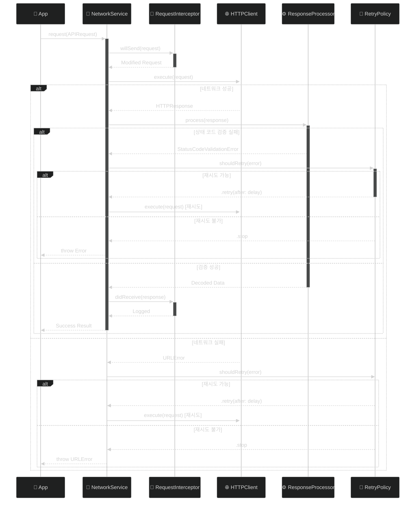

<div align="center">

# AsyncNetwork

### 순수 Foundation 기반의 Swift 네트워크 라이브러리

[](https://swift.org)
[](https://developer.apple.com/swift)
[](LICENSE)
[](https://github.com/Jimmy-Jung/AsyncNetwork/releases)
[](https://swift.org/package-manager)

</div>

---

## 왜 AsyncNetwork인가?

AsyncNetwork은 순수 Foundation만을 사용하여 구축된 현대적인 Swift 네트워크 라이브러리입니다.

### 주요 특징

- ✅ **순수 Foundation**: URLSession, Codable, async/await만 사용 (외부 의존성 제로)
- ⚡ **Swift Concurrency 네이티브**: async/await 완벽 지원
- 🧱 **책임별 모듈 구조**: 명확한 단일 책임 원칙 (Models, Client, Service 등)
- 🔄 **재시도 정책**: 유연한 재시도 전략 (지수 백오프, 커스텀 규칙)
- 🔗 **Chain of Responsibility 패턴**: 확장 가능한 응답 처리 파이프라인
- 🔌 **RequestInterceptor**: 프로토콜 기반 요청/응답 인터셉터 (로깅, 인증 등)
- 🪄 **매크로 지원**: `@APIRequest` 매크로로 보일러플레이트 제거
- 🎯 **Property Wrappers**: 선언적 API (`@QueryParameter`, `@PathParameter`, `@RequestBody`, `@HeaderField`)
- 📡 **Network Reachability**: 실시간 네트워크 연결 상태 감지
- 🧪 **테스트 용이성**: MockURLProtocol 지원, 의존성 주입 설계

### 다른 라이브러리와 비교

| 특징 | AsyncNetwork | Alamofire | Moya |
|-----|-------------|-----------|------|
| 외부 의존성 | ❌ 없음 | ✅ 있음 (AFNetworking 등) | ✅ 있음 (Alamofire) |
| Swift Concurrency | ✅ 네이티브 | ⚠️ 부분 지원 | ⚠️ 부분 지원 |
| 매크로 지원 | ✅ `@APIRequest` | ❌ | ❌ |
| 재시도 정책 | ✅ 프로토콜 기반 | ✅ | ⚠️ 제한적 |
| Network Reachability | ✅ 내장 | ✅ | ❌ |
| Chain of Responsibility | ✅ | ❌ | ❌ |
| Property Wrappers | ✅ 5종 (Query, Path, Body, Header, Custom) | ❌ | ❌ |
| 학습 곡선 | 낮음 (Foundation 기반) | 중간 | 중간 |

---

## 📦 설치

### Swift Package Manager

#### Xcode에서 추가

1. Xcode에서 `File` → `Add Package Dependencies...`
2. URL 입력:
```
https://github.com/Jimmy-Jung/AsyncNetwork.git
```
3. Version: `1.2.0` 이상 선택

#### Package.swift에 추가

```swift
dependencies: [
    .package(url: "https://github.com/Jimmy-Jung/AsyncNetwork.git", from: "1.2.0")
]
```

타겟 의존성:

```swift
.target(
    name: "YourTarget",
    dependencies: [
        .product(name: "AsyncNetwork", package: "AsyncNetwork")
    ]
)
```

---

## 🚀 빠른 시작

### NetworkService 초기화

```swift
import AsyncNetwork

// 기본 초기화 (ConsoleLoggingInterceptor 포함)
let service = NetworkService()

// 커스텀 설정으로 초기화
let service = NetworkService(
    httpClient: HTTPClient(timeout: 60),
    retryPolicy: .aggressive,
        checkNetworkBeforeRequest: true
)
    plugins: [
        ConsoleLoggingInterceptor(minimumLevel: .info)
    ]
)

// 사전 정의된 설정 사용
let devService = NetworkService(
    configuration: .development  // 빠른 타임아웃, 최소 재시도
)

let testService = NetworkService(
    configuration: .test  // 재시도 없음, 로깅 비활성화
)

let stableService = NetworkService(
    configuration: .stable  // 긴 타임아웃, 많은 재시도
)

let fastService = NetworkService(
    configuration: .fast  // 빠른 응답, 로깅 없음
)
```

### 1️⃣ 기본 사용법

```swift
import AsyncNetwork

// 1. 응답 모델 정의
struct Post: Codable {
    let id: Int
    let title: String
    let body: String
}

// 2. @APIRequest 매크로로 API 요청 정의
@APIRequest(
    response: [Post].self,
    title: "Get all posts",
    baseURL: "https://jsonplaceholder.typicode.com",
    path: "/posts",
    method: .get
)
struct GetAllPostsRequest {}

// 3. 네트워크 서비스 생성 및 요청
let service = NetworkService()
let posts: [Post] = try await service.request(GetAllPostsRequest())

print("총 \(posts.count)개의 게시글")
```

### 2️⃣ Query Parameters

```swift
@APIRequest(
    response: [Post].self,
    title: "Search posts by user",
    baseURL: "https://jsonplaceholder.typicode.com",
    path: "/posts",
    method: .get
)
struct GetPostsByUserRequest {
    @QueryParameter var userId: Int
}

// 사용
let posts: [Post] = try await service.request(
    GetPostsByUserRequest(userId: 1)
)
// 결과: GET /posts?userId=1
```

### 3️⃣ Path Parameters

```swift
@APIRequest(
    response: Post.self,
    title: "Get post by ID",
    baseURL: "https://jsonplaceholder.typicode.com",
    path: "/posts/{id}",  // {id}는 PathParameter로 대체됨
    method: .get
)
struct GetPostRequest {
    @PathParameter var id: Int
}

// 사용
let post: Post = try await service.request(GetPostRequest(id: 42))
// 결과: GET /posts/42
```

### 4️⃣ Request Body (POST/PUT)

```swift
struct LoginBody: Codable {
    let username: String
    let password: String
}

struct LoginResponse: Codable {
    let token: String
    let userId: Int
}

@APIRequest(
    response: LoginResponse.self,
    title: "User login",
    baseURL: "https://api.example.com",
    path: "/auth/login",
    method: .post
)
struct LoginRequest {
    @RequestBody var body: LoginBody
}

// 사용
let response: LoginResponse = try await service.request(
    LoginRequest(body: LoginBody(username: "user", password: "pass"))
)
```

### 5️⃣ Custom Headers

```swift
@APIRequest(
    response: UserProfile.self,
    title: "Get user profile",
    baseURL: "https://api.example.com",
    path: "/me",
    method: .get
)
struct GetProfileRequest {
    @HeaderField(key: .authorization) var authorization: String
}

// 사용
let profile: UserProfile = try await service.request(
    GetProfileRequest(authorization: "Bearer \(token)")
)
// 결과: GET /me (Authorization 헤더 포함)
```

#### 커스텀 헤더 (HTTPHeaders.HeaderKey에 없는 경우)

```swift
@APIRequest(
    response: UserProfile.self,
    title: "Get user profile",
    baseURL: "https://api.example.com",
    path: "/me",
    method: .get
)
struct GetProfileRequest {
    @CustomHeader("X-Custom-Header") var customValue: String
}

// 사용
let profile: UserProfile = try await service.request(
    GetProfileRequest(customValue: "custom-value")
)
```

---

## 🏗️ 아키텍처

AsyncNetwork은 책임별로 명확하게 분리된 모듈 구조를 가지고 있습니다.

### 모듈 구조

AsyncNetwork은 세 가지 주요 모듈로 구성됩니다:

1. **AsyncNetworkCore**: 핵심 네트워크 기능 (HTTPClient, NetworkService, Property Wrappers 등)
2. **AsyncNetworkMacros**: `@APIRequest` 매크로 구현 (Clean Architecture 기반)
3. **AsyncNetwork**: Core + Macros를 통합한 Umbrella 모듈 (권장)

대부분의 경우 `import AsyncNetwork`만으로 모든 기능을 사용할 수 있습니다.

#### 매크로 아키텍처 (v1.2.0+)

`@APIRequest` 매크로는 Clean Architecture 원칙에 따라 설계되었습니다:

```
AsyncNetworkMacros/
├── Domain/              # 비즈니스 로직 (순수 Swift)
│   ├── Models/          # MacroArguments, MacroContext, PropertyInfo
│   ├── Parsers/         # APIRequestArgumentParser, PathParser
│   ├── Validators/      # MacroValidator, PropertyWrapperValidator
│   └── Generators/      # CodeGenerator, MetadataGenerator, TestGenerator
├── Facade/              # 단일 진입점
│   └── APIRequestMacroFacade.swift
└── Infrastructure/      # SwiftSyntax 기반 기술
    ├── DiagnosticBuilder.swift
    ├── ExpressionParser.swift
    └── SyntaxExtensions.swift
```

설계 원칙:
- 단일 책임 원칙: 각 컴포넌트는 하나의 책임만
- 의존성 역전: 도메인은 인프라에 의존하지 않음
- 테스트 용이성: 각 레이어 독립 테스트 가능

### 소스 코드 구조

```
AsyncNetwork/
├── Models/              # 도메인 모델 (HTTPMethod, HTTPResponse 등)
├── Protocols/           # 프로토콜 정의 (APIRequest, RequestInterceptor 등)
├── Configuration/       # 설정 및 정책 (RetryPolicy)
├── Client/              # HTTP 클라이언트 (HTTPClient, HTTPHeaders)
├── Interceptors/        # 인터셉터 (LoggingInterceptor 등)
├── Processing/          # 응답 처리 (ResponseProcessor, StatusCodeValidator)
├── Service/             # 네트워크 서비스 (NetworkService)
├── Errors/              # 에러 처리 (ErrorMapper, NetworkError)
├── PropertyWrappers/    # Property Wrappers (@QueryParameter 등)
└── Utilities/           # 유틸리티 (AsyncDelayer, NetworkMonitor)
```

### 데이터 흐름


```mermaid
%%{init: {
  'theme': 'dark',
  'themeVariables': { 'lineColor': '#e2e8f0', 'textColor': '#f8fafc' }
}}%%
sequenceDiagram
    participant App as 📱 App
    participant Service as 🎯 NetworkService
    participant Interceptor as 🔌 RequestInterceptor
    participant Client as 🌐 HTTPClient
    participant Processor as ⚙️ ResponseProcessor
    participant Retry as 🔄 RetryPolicy
    
    App->>+Service: request(APIRequest)
    Service->>+Interceptor: willSend(request)
    Interceptor-->>-Service: Modified Request
    Service->>+Client: execute(request)
    
    alt 네트워크 성공
        Client-->>Service: HTTPResponse
        Service->>+Processor: process(response)
        
        alt 상태 코드 검증 실패
            Processor-->>Service: StatusCodeValidationError
            Service->>+Retry: shouldRetry(error)
            
            alt 재시도 가능
                Retry-->>-Service: .retry(after: delay)
                Service->>Client: execute(request) [재시도]
            else 재시도 불가
                Retry-->>Service: .stop
                Service-->>App: throw Error
            end
        else 검증 성공
            Processor-->>-Service: Decoded Data
            Service->>+Interceptor: didReceive(response)
            Interceptor-->>-Service: Logged
            Service-->>-App: Success Result
        end
    else 네트워크 실패
        Client-->>Service: URLError
        Service->>Retry: shouldRetry(error)
        alt 재시도 가능
            Retry-->>Service: .retry(after: delay)
            Service->>Client: execute(request) [재시도]
        else 재시도 불가
            Retry-->>Service: .stop
            Service-->>App: throw URLError
        end
    end
```

---

## 🔥 고급 기능

### RequestInterceptor

요청/응답을 가로채서 로깅, 인증 토큰 추가 등을 수행할 수 있습니다.

```swift
import Foundation
import AsyncNetwork

final class AuthInterceptor: RequestInterceptor {
    private var accessToken: String?
    
    func prepare(_ request: inout URLRequest, target: (any APIRequest)?) async throws {
        // 인증 토큰 자동 추가
        if let token = accessToken {
            request.setValue(
                "Bearer \(token)",
                forHTTPHeaderField: "Authorization"
            )
        }
    }
    
    func willSend(_ request: URLRequest, target: (any APIRequest)?) async {
        // 요청 전송 직전 로깅
        print("🚀 Sending: \(request.url?.absoluteString ?? "")")
    }
    
    func didReceive(_ response: HTTPResponse, target: (any APIRequest)?) async {
        // 응답 수신 후 로깅
        print("📥 Response: \(response.statusCode)")
    }
}

// 서비스에 인터셉터 추가
let authInterceptor = AuthInterceptor()
let service = NetworkService(
    plugins: [authInterceptor]
)
```

#### ConsoleLoggingInterceptor

기본 제공되는 로깅 인터셉터로, 네트워크 요청/응답을 자동으로 콘솔에 출력합니다.

```swift
import AsyncNetwork

// 기본 설정 (verbose 레벨)
let service = NetworkService() // 기본적으로 ConsoleLoggingInterceptor 포함

// 로그 레벨 조정
let service = NetworkService(
    plugins: [
        ConsoleLoggingInterceptor(minimumLevel: .info) // info 이상만 로깅
    ]
)

// 민감한 정보 필터링
let service = NetworkService(
    plugins: [
        ConsoleLoggingInterceptor(
            minimumLevel: .debug,
            sensitiveKeys: ["password", "token", "apiKey", "secret"]
        )
    ]
)
```

사용 가능한 로그 레벨:
- `.verbose`: 모든 로그 출력
- `.debug`: 디버그 정보 포함
- `.info`: 정보성 메시지
- `.warning`: 경고 메시지
- `.error`: 에러 메시지
- `.fatal`: 치명적 에러만

### RetryPolicy

네트워크 실패 시 재시도 정책을 커스터마이징할 수 있습니다.

```swift
import AsyncNetwork

// 1. 커스텀 재시도 규칙
struct CustomRetryRule: RetryRule {
    func shouldRetry(error: Error) -> Bool? {
        // 401 에러는 재시도하지 않음
        if let statusError = error as? StatusCodeValidationError,
           statusError.statusCode == 401 {
            return false
        }
        
        // 500번대 서버 에러는 재시도
        if let statusError = error as? StatusCodeValidationError {
            switch statusError {
            case .serverError:
                return true
            case .clientError:
                return false
            default:
                return nil
            }
        }
        
        // 다음 룰로 패스
        return nil
    }
}

// 2. 재시도 정책 생성 및 서비스에 적용
let retryPolicy = RetryPolicy(
    configuration: RetryConfiguration(
        maxRetries: 3,
        baseDelay: 1.0,
        maxDelay: 30.0,
        jitterRange: 0.1...0.3  // 지터 추가로 동시 재시도 방지
    ),
    rules: [CustomRetryRule(), URLErrorRetryRule(), ServerErrorRetryRule()]
)

let service = NetworkService(
    httpClient: HTTPClient(),
    retryPolicy: retryPolicy,
    responseProcessor: ResponseProcessor()
)
```

#### 사전 정의된 RetryPolicy

```swift
// 기본 정책 (maxRetries: 3, baseDelay: 1.0)
let service = NetworkService(
    httpClient: HTTPClient(),
    retryPolicy: .default,
    responseProcessor: ResponseProcessor()
)

// 공격적 정책 (maxRetries: 5, baseDelay: 0.5)
let service = NetworkService(
    httpClient: HTTPClient(),
    retryPolicy: .aggressive,
    responseProcessor: ResponseProcessor()
)

// 보수적 정책 (maxRetries: 1, baseDelay: 2.0)
let service = NetworkService(
    httpClient: HTTPClient(),
    retryPolicy: .conservative,
    responseProcessor: ResponseProcessor()
)

// 재시도 없음
let service = NetworkService(
    httpClient: HTTPClient(),
    retryPolicy: .none,
    responseProcessor: ResponseProcessor()
)
```

#### RetryConfiguration 옵션

```swift
let configuration = RetryConfiguration(
    maxRetries: 3,              // 최대 재시도 횟수
    baseDelay: 1.0,            // 기본 지연 시간 (초)
    maxDelay: 30.0,            // 최대 지연 시간 (초)
    jitterRange: 0.1...0.3      // 지터 범위 (동시 재시도 방지)
)

// 사전 정의된 설정
let aggressive = RetryConfiguration.aggressive  // maxRetries: 5, baseDelay: 0.5
let conservative = RetryConfiguration.conservative  // maxRetries: 1, baseDelay: 2.0
```

### Response Processing Pipeline

Chain of Responsibility 패턴으로 확장 가능한 응답 처리 파이프라인을 구축할 수 있습니다.

```swift
import AsyncNetwork

// 1. 커스텀 프로세서 단계
struct CustomLoggingStep: ResponseProcessorStep {
    func process(_ response: HTTPResponse) throws -> HTTPResponse {
        print("📊 [Metrics] Status: \(response.statusCode), Size: \(response.data.count) bytes")
        return response
    }
}

// 2. 프로세서 체인 구성
let customProcessor = ResponseProcessor(
    steps: [
        CustomLoggingStep(),
        StatusCodeValidator()  // 기본 제공
    ]
)

// 3. 서비스에 적용
let service = NetworkService(
    httpClient: HTTPClient(),
    retryPolicy: RetryPolicy(),
    responseProcessor: customProcessor
)
```

### 6️⃣ 복합 Property Wrappers

여러 Property Wrapper를 조합하여 복잡한 요청을 간결하게 표현할 수 있습니다.

```swift
@APIRequest(
    response: SearchResult.self,
    title: "Search with filters",
    baseURL: "https://api.example.com",
    path: "/search/{category}",
    method: .get
)
struct SearchRequest {
    @PathParameter var category: String
    @QueryParameter var query: String
    @QueryParameter var page: Int
    @QueryParameter var limit: Int
    @HeaderField(key: .authorization) var authorization: String
}

// 사용
let result: SearchResult = try await service.request(
    SearchRequest(
        category: "books",
        query: "Swift",
        page: 1,
        limit: 20,
        authorization: "Bearer \(token)"
    )
)
// 결과: GET /search/books?query=Swift&page=1&limit=20 (Authorization 헤더 포함)
```

### 7️⃣ 다양한 응답 타입 처리

#### Data 직접 반환

```swift
// 이미지나 바이너리 데이터를 직접 받을 때
let imageData: Data = try await service.requestData(GetImageRequest(id: 123))
```

#### Raw HTTPResponse 반환

```swift
// 상태 코드, 헤더 등 전체 응답 정보가 필요할 때
let response: HTTPResponse = try await service.requestRaw(GetPostsRequest())
print("Status: \(response.statusCode)")
print("Headers: \(response.response?.allHeaderFields)")
```

#### 빈 응답 처리

```swift
import AsyncNetwork

@APIRequest(
    response: EmptyResponse.self,
    title: "Delete post",
    baseURL: "https://api.example.com",
    path: "/posts/{id}",
    method: .delete
)
struct DeletePostRequest {
    @PathParameter var id: Int
}

// 사용
try await service.request(DeletePostRequest(id: 123))
// 응답 본문이 없는 경우 EmptyResponse 사용
```

### Network Reachability (네트워크 연결 감지)

실시간으로 네트워크 연결 상태를 모니터링하고 오프라인 상태를 처리할 수 있습니다.

#### SwiftUI에서 사용

```swift
import SwiftUI
import AsyncNetwork

struct ContentView: View {
    @StateObject private var networkMonitor = NetworkMonitor.shared
    @State private var posts: [Post] = []
    
    var body: some View {
        NavigationView {
            Group {
                if !networkMonitor.isConnected {
                    OfflineView()
                } else {
                    PostListView(posts: posts)
                }
            }
            .navigationTitle("Posts")
            .toolbar {
                ToolbarItem(placement: .navigationBarTrailing) {
                    NetworkStatusIndicator(
                        isConnected: networkMonitor.isConnected,
                        type: networkMonitor.connectionType
                    )
                }
            }
        }
        .task {
            await loadPosts()
        }
        .onChange(of: networkMonitor.isConnected) { _, newValue in
            if newValue {
                // 네트워크 복구 시 자동 재시도
                Task {
                    await loadPosts()
                }
            }
        }
    }
    
    private func loadPosts() async {
        do {
            let service = NetworkService()
            posts = try await service.request(GetPostsRequest())
        } catch let error as NetworkError where error.isOffline {
            // 오프라인 에러 처리
            print("오프라인 상태입니다")
        } catch {
            print("에러: \(error)")
        }
    }
}

struct NetworkStatusIndicator: View {
    let isConnected: Bool
    let type: NetworkMonitor.ConnectionType
    
    var body: some View {
        HStack(spacing: 4) {
            Circle()
                .fill(isConnected ? Color.green : Color.red)
                .frame(width: 8, height: 8)
            
            Text(isConnected ? type.description : "오프라인")
                .font(.caption)
                .foregroundColor(isConnected ? .green : .red)
        }
    }
}
```

#### Combine으로 구독

```swift
import Combine
import AsyncNetwork

class PostViewModel: ObservableObject {
    @Published var posts: [Post] = []
    @Published var isLoading = false
    @Published var errorMessage: String?
    
    private let service = NetworkService()
    private var cancellables = Set<AnyCancellable>()
    
    init() {
        // 네트워크 상태 변경 감지
        NetworkMonitor.shared.$isConnected
            .dropFirst() // 초기값 무시
            .sink { [weak self] isConnected in
                if isConnected {
                    // 네트워크 복구 시 자동 재시도
                    Task { @MainActor [weak self] in
                        await self?.loadPosts()
                    }
                } else {
                    // 오프라인 상태 표시
                    self?.errorMessage = "인터넷 연결이 끊어졌습니다"
                }
            }
            .store(in: &cancellables)
    }
    
    @MainActor
    func loadPosts() async {
        guard NetworkMonitor.shared.isConnected else {
            errorMessage = "오프라인 상태입니다"
            return
        }
        
        isLoading = true
        errorMessage = nil
        
        do {
            posts = try await service.request(GetPostsRequest())
        } catch let error as NetworkError where error.isOffline {
            errorMessage = "네트워크 연결을 확인해주세요"
        } catch {
            errorMessage = error.localizedDescription
        }
        
        isLoading = false
    }
}
```

#### NetworkService 오프라인 체크

```swift
let service = NetworkService()

// 자동 오프라인 체크 활성화 (기본값)
do {
    let posts = try await service.request(GetPostsRequest())
} catch let error as NetworkError where error.isOffline {
    // 오프라인 시 즉시 에러 반환 (실제 요청 전)
    showOfflineAlert()
}

// 수동으로 체크
if service.isNetworkAvailable {
    let posts = try await service.request(GetPostsRequest())
} else {
    // 캐시에서 로드하거나 사용자에게 알림
    showOfflineMessage()
}

// 연결 타입 확인
switch service.connectionType {
case .wifi:
    print("Wi-Fi 연결")
case .cellular:
    print("셀룰러 연결")
case .ethernet:
    print("이더넷 연결")
case .loopback:
    print("로컬 루프백")
default:
    print("알 수 없는 연결")
}

// 오프라인 체크 비활성화 (테스트 환경 등)
let service = NetworkService(
        checkNetworkBeforeRequest: false
)
```

#### NetworkMonitor 고급 기능

```swift
import AsyncNetwork

let monitor = NetworkMonitor.shared

// 연결 상태 확인
if monitor.isConnected {
    print("네트워크 연결됨")
}

// 연결 타입 확인
print("연결 타입: \(monitor.connectionType.description)")

// 비용이 많이 드는 연결인지 확인 (셀룰러 등)
if monitor.isExpensive {
    print("⚠️ 비용이 많이 드는 연결입니다")
    // 대용량 다운로드 지연 등
}

// 제한된 연결인지 확인 (Low Data Mode 등)
if monitor.isConstrained {
    print("⚠️ 제한된 연결입니다")
    // 이미지 품질 낮추기 등
}

// NotificationCenter로 네트워크 상태 변경 감지
NotificationCenter.default.addObserver(
    forName: .networkStatusChanged,
    object: nil,
    queue: .main
) { notification in
    if let isConnected = notification.userInfo?["isConnected"] as? Bool {
        print("네트워크 상태 변경: \(isConnected ? "연결됨" : "끊어짐")")
    }
    if let type = notification.userInfo?["connectionType"] as? NetworkMonitor.ConnectionType {
        print("연결 타입: \(type.description)")
    }
}
```

## 🧪 테스트

AsyncNetwork은 테스트하기 쉽게 설계되었습니다.

### MockURLProtocol 사용

```swift
import Testing
@testable import AsyncNetwork

// 테스트용 모델 정의
struct User: Codable, Equatable {
    let id: Int
    let name: String
}

// 테스트용 API 요청 정의
@APIRequest(
    response: [User].self,
    title: "Get users",
    baseURL: "https://api.example.com",
    path: "/users",
    method: .get
)
struct GetUsersRequest {}

@Test("사용자 목록 조회 성공")
func testGetUsersSuccess() async throws {
    // Given
    let path = "/users"
    let mockJSON = """
    [
        {"id": 1, "name": "John"},
        {"id": 2, "name": "Jane"}
    ]
    """
    
    let config = URLSessionConfiguration.ephemeral
    config.protocolClasses = [MockURLProtocol.self]
    let session = URLSession(configuration: config)
    
    await MockURLProtocol.register(path: path) { request in
        let response = HTTPURLResponse(
            url: request.url!,
            statusCode: 200,
            httpVersion: nil,
            headerFields: ["Content-Type": "application/json"]
        )!
        return (response, mockJSON.data(using: .utf8)!)
    }
    
    let client = HTTPClient(session: session)
    let service = NetworkService(
        httpClient: client,
        retryPolicy: .none,
        responseProcessor: ResponseProcessor()
    )
    
    // When
    let users = try await service.request(GetUsersRequest())
    
    // Then
    #expect(users.count == 2)
    #expect(users[0].name == "John")
}

// 테스트용 API 요청 정의
@APIRequest(
    response: EmptyResponse.self,
    title: "Test retry request",
    baseURL: "https://api.example.com",
    path: "/users/retry",
    method: .get
)
struct TestRetryRequest {}

@Test("재시도 정책 테스트")
func testRetryPolicy() async throws {
    // Given
    let path = "/users/retry"
    let config = URLSessionConfiguration.ephemeral
    config.protocolClasses = [MockURLProtocol.self]
    let session = URLSession(configuration: config)
    
    var attemptCount = 0
    
    await MockURLProtocol.register(path: path) { request in
        attemptCount += 1
        
        if attemptCount < 3 {
            throw URLError(.timedOut)
        }
        
        let response = HTTPURLResponse(
            url: request.url!,
            statusCode: 200,
            httpVersion: nil,
            headerFields: nil
        )!
        return (response, Data())
    }
    
    let client = HTTPClient(session: session)
    let retryPolicy = RetryPolicy(
        configuration: RetryConfiguration(maxRetries: 3, baseDelay: 0.1)
    )
    let service = NetworkService(
        httpClient: client,
        retryPolicy: retryPolicy,
        responseProcessor: ResponseProcessor()
    )
    
    // When
    _ = try await service.requestRaw(TestRetryRequest())
    
    // Then
    #expect(attemptCount == 3)
    
    // 테스트 후 정리
    await MockURLProtocol.clear()
}
```

#### 테스트 후 정리

```swift
@Test("테스트 예제")
func testExample() async throws {
    // Given
    await MockURLProtocol.register(path: "/test") { request in
        // ...
    }
    
    // When & Then
    // ...
    
    // 테스트 후 Mock 라우트 정리 (선택사항)
    await MockURLProtocol.clear()
}
```

---

## 📚 문서

### 🎯 추가 리소스

- 📱 [AsyncNetworkDocKitExample](Projects/AsyncNetworkDocKitExample) - API 문서 앱 데모
- 🐛 [Issues](https://github.com/Jimmy-Jung/AsyncNetwork/issues) - 버그 리포트 및 기능 제안
- 💬 [Discussions](https://github.com/Jimmy-Jung/AsyncNetwork/discussions) - 질문 및 피드백

---

## 🤝 기여하기

AsyncNetwork은 오픈소스 프로젝트이며, 여러분의 기여를 환영합니다! 🎉

### 기여 방법

1. **이슈 확인**: [Issues](https://github.com/Jimmy-Jung/AsyncNetwork/issues)에서 해결하고 싶은 문제 찾기
2. **Fork**: 저장소를 Fork합니다
3. **브랜치 생성**: `git checkout -b feature/amazing-feature`
4. **변경사항 작성**: 코드 작성 및 테스트 추가
5. **커밋**: `git commit -m 'feat: add amazing feature'`
6. **푸시**: `git push origin feature/amazing-feature`
7. **Pull Request**: GitHub에서 PR 생성

### 좋은 첫 이슈

처음 기여하시나요? `good first issue` 라벨이 붙은 이슈부터 시작해보세요!

---

## 📄 라이선스

AsyncNetwork은 MIT License로 배포됩니다.

```
MIT License

Copyright (c) 2025 Jimmy Jung

Permission is hereby granted, free of charge, to any person obtaining a copy
of this software and associated documentation files (the "Software"), to deal
in the Software without restriction, including without limitation the rights
to use, copy, modify, merge, publish, distribute, sublicense, and/or sell
copies of the Software, and to permit persons to whom the Software is
furnished to do so, subject to the following conditions:

The above copyright notice and this permission notice shall be included in all
copies or substantial portions of the Software.

THE SOFTWARE IS PROVIDED "AS IS", WITHOUT WARRANTY OF ANY KIND, EXPRESS OR
IMPLIED, INCLUDING BUT NOT LIMITED TO THE WARRANTIES OF MERCHANTABILITY,
FITNESS FOR A PARTICULAR PURPOSE AND NONINFRINGEMENT. IN NO EVENT SHALL THE
AUTHORS OR COPYRIGHT HOLDERS BE LIABLE FOR ANY CLAIM, DAMAGES OR OTHER
LIABILITY, WHETHER IN AN ACTION OF CONTRACT, TORT OR OTHERWISE, ARISING FROM,
OUT OF OR IN CONNECTION WITH THE SOFTWARE OR THE USE OR OTHER DEALINGS IN THE
SOFTWARE.
```

---

## 🙏 감사의 말

AsyncNetwork은 다음 프로젝트들에서 영감을 받았습니다:

- [Alamofire](https://github.com/Alamofire/Alamofire) - Swift HTTP 네트워킹 라이브러리
- [Moya](https://github.com/Moya/Moya) - 계층화된 네트워크 추상화
- [AsyncViewModel](https://github.com/Jimmy-Jung/AsyncViewModel) - 프로젝트 구조 참고

그리고 프로젝트에 기여해주신 모든 분들께 감사드립니다! 🙏

---

## 👨‍💻 만든 사람

**Jimmy Jung (정준영)**  
iOS Developer from Seoul, South Korea 🇰🇷

- GitHub: [@Jimmy-Jung](https://github.com/Jimmy-Jung)
- Email: joony300@gmail.com

---

## ⭐ 후원

AsyncNetwork이 도움이 되었나요? ⭐ Star를 눌러주세요!

프로젝트 개발을 지원하고 싶으시다면:

- ⭐ GitHub Star
- 🐛 버그 리포트 및 기능 제안
- 📝 문서 개선
- 💻 코드 기여
- 📢 프로젝트 공유

---

<div align="center">

**Made with ❤️ and ☕ in Seoul, Korea**

⬆️ [맨 위로](#asyncnetwork)

</div>

