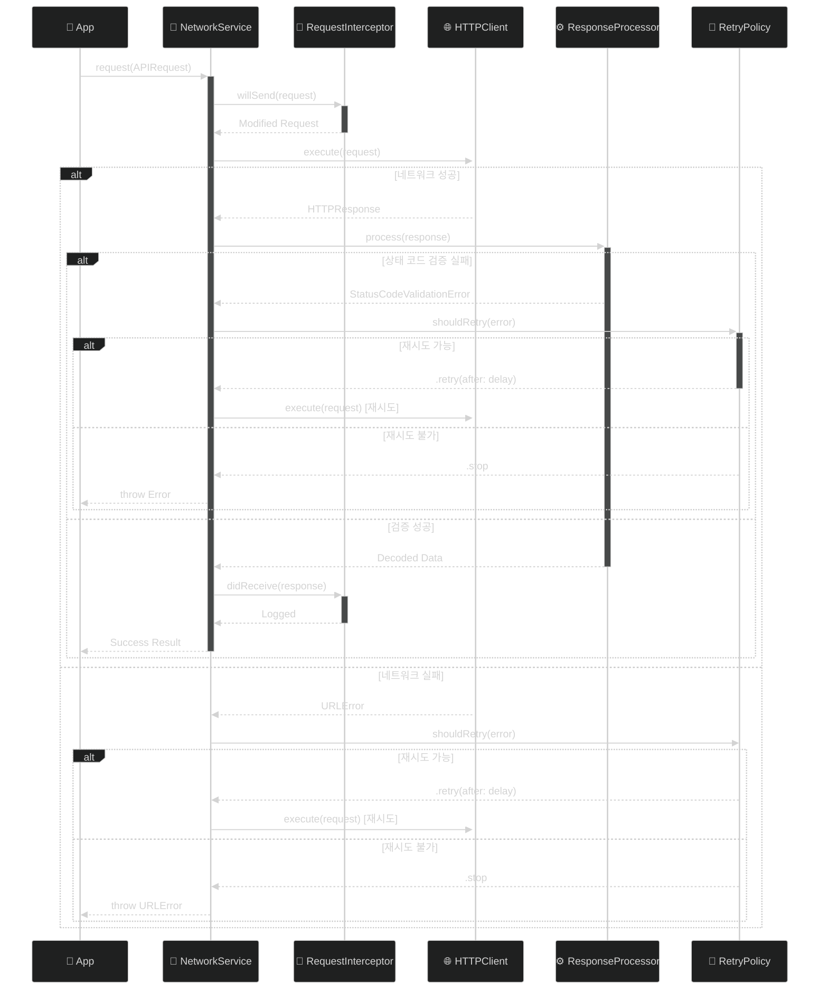

<div align="center">

# AsyncNetwork

### 순수 Foundation 기반의 Swift 네트워크 라이브러리

[](https://swift.org)
[](https://developer.apple.com/swift)
[](LICENSE)
[](https://github.com/Jimmy-Jung/AsyncNetwork/releases)
[](https://swift.org/package-manager)

</div>

---

## 왜 AsyncNetwork인가?

### 이런 경험 있으신가요?

```swift
// 😫 기존 방식: 반복되는 보일러플레이트
func fetchPosts() async throws -> [Post] {
    // 1. URL 조합
    guard var components = URLComponents(string: "https://api.example.com") else {
        throw NetworkError.invalidURL
    }
    components.path = "/posts"
    components.queryItems = [
        URLQueryItem(name: "userId", value: "\(userId)"),
        URLQueryItem(name: "page", value: "\(page)")
    ]
    
    guard let url = components.url else {
        throw NetworkError.invalidURL
    }
    
    // 2. URLRequest 생성
    var request = URLRequest(url: url)
    request.httpMethod = "GET"
    request.setValue("Bearer \(token)", forHTTPHeaderField: "Authorization")
    request.setValue("application/json", forHTTPHeaderField: "Content-Type")
    
    // 3. 네트워크 요청
    let (data, response) = try await URLSession.shared.data(for: request)
    
    // 4. 상태 코드 검증
    guard let httpResponse = response as? HTTPURLResponse else {
        throw NetworkError.invalidResponse
    }
    
    guard (200...299).contains(httpResponse.statusCode) else {
        throw NetworkError.serverError(httpResponse.statusCode)
    }
    
    // 5. 디코딩
    let decoder = JSONDecoder()
    return try decoder.decode([Post].self, from: data)
}
```

**문제점:**
- 🔄 매번 같은 코드를 반복 작성 (URL 조합, 헤더 설정, 에러 처리)
- 🐛 오타나 실수로 인한 버그 (쿼리 파라미터 이름, 헤더 키 등)
- 🔁 재시도 로직을 직접 구현해야 함
- 📝 테스트 코드 작성이 어려움 (URLSession mocking)
- 🔌 로깅, 인증 토큰 갱신 등을 각 요청마다 중복 구현

---

### AsyncNetwork로 해결하세요

```swift
// ✨ AsyncNetwork: 간결하고 타입 안전한 API
@APIRequest(
    response: [Post].self,
    baseURL: "https://api.example.com",
    path: "/posts",
    method: .get
)
struct GetPostsRequest {
    @QueryParameter var userId: Int  // ✅ 필수 파라미터 (Non-optional)
    @QueryParameter var page: Int    // ✅ 필수 파라미터 (Non-optional)
    @HeaderField(key: .authorization) var authorization: String?
    
    init(userId: Int, page: Int, authorization: String?) {
        self.userId = userId
        self.page = page
        self.authorization = authorization
    }
}

// 사용
let posts: [Post] = try await service.request(
    GetPostsRequest(userId: 1, page: 2, authorization: "Bearer \(token)")
)
```

**개선 사항:**
- ✅ **90% 코드 감소**: 보일러플레이트 자동 생성
- 🎯 **타입 안전성**: 컴파일 타임에 오류 감지
- 🔄 **재시도 자동화**: 네트워크 실패 시 지수 백오프로 자동 재시도
- 🔌 **인터셉터 패턴**: 로깅, 인증 토큰 갱신을 한 곳에서 처리
- 🧪 **테스트 용이**: MockURLProtocol으로 쉬운 단위 테스트

---

### 주요 특징

- ✅ **순수 Foundation**: URLSession, Codable, async/await만 사용 (외부 의존성 제로)
- ⚡ **Swift Concurrency 네이티브**: async/await 완벽 지원
- 🪄 **매크로 지원**: `@APIRequest` 매크로로 보일러플레이트 90% 제거
- 🎯 **Property Wrappers**: 선언적 API (`@QueryParameter`, `@PathParameter`, `@RequestBody`, `@HeaderField`)
- 🔄 **스마트 재시도**: 유연한 재시도 전략 (지수 백오프, 커스텀 규칙, Jitter)
- 🔌 **인터셉터 패턴**: 프로토콜 기반 요청/응답 인터셉터 (로깅, 인증 등)
- 🔗 **Chain of Responsibility**: 확장 가능한 응답 처리 파이프라인
- 📡 **Network Reachability**: 실시간 네트워크 연결 상태 감지
- 🧱 **책임별 모듈 구조**: 명확한 단일 책임 원칙 (Models, Client, Service 등)
- 🧪 **테스트 용이성**: MockURLProtocol 지원, 의존성 주입 설계

### 다른 라이브러리와 비교

| 특징 | AsyncNetwork | Alamofire | Moya |
|-----|-------------|-----------|------|
| 외부 의존성 | ❌ 없음 | ✅ 있음 (AFNetworking 등) | ✅ 있음 (Alamofire) |
| Swift Concurrency | ✅ 네이티브 | ⚠️ 부분 지원 | ⚠️ 부분 지원 |
| 매크로 지원 | ✅ `@APIRequest` | ❌ | ❌ |
| 재시도 정책 | ✅ 프로토콜 기반 | ✅ | ⚠️ 제한적 |
| Network Reachability | ✅ 내장 | ✅ | ❌ |
| Chain of Responsibility | ✅ | ❌ | ❌ |
| Property Wrappers | ✅ 5종 (Query, Path, Body, Header, Custom) | ❌ | ❌ |
| 학습 곡선 | 낮음 (Foundation 기반) | 중간 | 중간 |

---

## 📦 설치

### Swift Package Manager

#### Xcode에서 추가

1. Xcode에서 `File` → `Add Package Dependencies...`
2. URL 입력:
```
https://github.com/Jimmy-Jung/AsyncNetwork.git
```
3. Version: `1.3.1` 이상 선택

#### Package.swift에 추가

```swift
dependencies: [
    .package(url: "https://github.com/Jimmy-Jung/AsyncNetwork.git", from: "1.3.1")
]
```

타겟 의존성:

```swift
.target(
    name: "YourTarget",
    dependencies: [
        .product(name: "AsyncNetwork", package: "AsyncNetwork")
    ]
)
```

---

## 🚀 빠른 시작

### NetworkService 초기화

```swift
import AsyncNetwork

// 기본 초기화 (ConsoleLoggingInterceptor 포함)
let service = NetworkService()

// 커스텀 설정으로 초기화
let service = NetworkService(
    httpClient: HTTPClient(),
    retryPolicy: RetryPolicy(configuration: .quick),
    interceptors: [
        ConsoleLoggingInterceptor(minimumLevel: .info)
    ],
    checkNetworkBeforeRequest: true
)

// 사전 정의된 설정 사용
let defaultService = NetworkService.default()  // 일반 API 요청용

let imageService = NetworkService.image()  // 이미지 다운로드용

let uploadService = NetworkService.upload()  // 파일 업로드용

let downloadService = NetworkService.download()  // 대용량 파일 다운로드용

let realtimeService = NetworkService.realtime()  // 실시간 API용

let offlineService = NetworkService.offline()  // 오프라인 우선 (캐시 우선)
```

### 1️⃣ 기본 사용법

```swift
import AsyncNetwork

// 1. 응답 모델 정의
struct Post: Codable, Sendable {
    let id: Int
    let title: String
    let body: String
    let userId: Int
}

// 2. @APIRequest 매크로로 API 요청 정의
@APIRequest(
    response: [Post].self,
    baseURL: "https://jsonplaceholder.typicode.com",
    path: "/posts",
    method: .get
)
struct GetAllPostsRequest {}

// 3. 네트워크 서비스 생성 및 요청
let service = NetworkService()
let posts: [Post] = try await service.request(GetAllPostsRequest())

print("총 \(posts.count)개의 게시글")
```

### 2️⃣ Query Parameters

@QueryParameter는 타입 레벨에서 필수/비필수를 구분합니다:
- **Non-optional 타입** (`Int`, `String` 등): 필수 파라미터 (항상 쿼리에 추가)
- **Optional 타입** (`Int?`, `String?` 등): 비필수 파라미터 (nil이면 쿼리에서 제외)

```swift
@APIRequest(
    response: [Post].self,
    baseURL: "https://jsonplaceholder.typicode.com",
    path: "/posts",
    method: .get
)
struct GetPostsByUserRequest {
    @QueryParameter var userId: Int                // ✅ 필수 파라미터 (Non-optional)
    @QueryParameter(key: "_limit") var limit: Int? // ✅ 비필수 파라미터 (Optional)
    @QueryParameter(key: "_page") var page: Int?   // ✅ 비필수 파라미터 (Optional)
    
    init(userId: Int, limit: Int? = nil, page: Int? = nil) {
        self.userId = userId
        self.limit = limit
        self.page = page
    }
}

// 사용
let posts: [Post] = try await service.request(
    GetPostsByUserRequest(userId: 1, limit: 10)  // page 생략
)
// 결과: GET /posts?userId=1&_limit=10
```

#### 커스텀 타입과 DefaultInitializable

Non-optional 커스텀 타입을 property 선언에서 key만 지정하여 사용하려면, `DefaultInitializable` 프로토콜을 구현해야 합니다:

```swift
// 커스텀 Enum
enum SortOrder: String, Sendable, DefaultInitializable {
    case asc
    case desc
    
    static var defaultValue: SortOrder { .asc }
}

@APIRequest(
    response: [Post].self,
    baseURL: "https://api.example.com",
    path: "/posts",
    method: .get
)
struct GetPostsSortedRequest {
    @QueryParameter(key: "sort") var sortOrder: SortOrder  // Non-optional 커스텀 타입
    
    init(sortOrder: SortOrder = .asc) {
        self.sortOrder = sortOrder
    }
}

// 사용
let posts: [Post] = try await service.request(
    GetPostsSortedRequest(sortOrder: .desc)
)
// 결과: GET /posts?sort=desc
```

**기본 타입은 이미 DefaultInitializable을 구현하고 있습니다:**
- `Int`, `String`, `Bool`, `Double`, `Float`
- `Int8`, `Int16`, `Int32`, `Int64`
- `UInt`, `UInt8`, `UInt16`, `UInt32`, `UInt64`

### 3️⃣ Path Parameters

```swift
@APIRequest(
    response: Post.self,
    baseURL: "https://jsonplaceholder.typicode.com",
    path: "/posts/{id}",  // {id}는 PathParameter로 대체됨
    method: .get
)
struct GetPostRequest {
    @PathParameter var id: Int
    
    init(id: Int) {
        self.id = id
    }
}

// 사용
let post: Post = try await service.request(GetPostRequest(id: 42))
// 결과: GET /posts/42
```

### 4️⃣ Request Body (POST/PUT)

```swift
struct PostBodyDTO: Codable, Sendable {
    let title: String
    let body: String
    let userId: Int
}

@APIRequest(
    response: Post.self,
    baseURL: "https://jsonplaceholder.typicode.com",
    path: "/posts",
    method: .post
)
struct CreatePostRequest {
    @RequestBody var body: PostBodyDTO?
    @HeaderField(key: .contentType) var contentType: String? = "application/json"
    
    init(body: PostBodyDTO? = nil, contentType: String? = "application/json") {
        self.body = body
        self.contentType = contentType
    }
}

// 사용
let newPost: Post = try await service.request(
    CreatePostRequest(body: PostBodyDTO(title: "제목", body: "내용", userId: 1))
)
```

### 5️⃣ Headers

#### @HeaderField - 표준 HTTP 헤더

@HeaderField는 타입 레벨에서 필수/비필수 헤더를 구분합니다:
- **Non-optional 타입** (`String` 등): 필수 헤더 (항상 추가)
- **Optional 타입** (`String?` 등): 비필수 헤더 (nil이면 추가되지 않음)

```swift
@APIRequest(
    response: UserProfile.self,
    baseURL: "https://api.example.com",
    path: "/me",
    method: .get
)
struct GetProfileRequest {
    @HeaderField(key: .authorization) var authorization: String?  // 비필수
    @HeaderField(key: .contentType) var contentType: String = "application/json"  // 필수 + 기본값
    
    init(authorization: String?, contentType: String = "application/json") {
        self.authorization = authorization
        self.contentType = contentType
    }
}

// 사용
let profile: UserProfile = try await service.request(
    GetProfileRequest(authorization: "Bearer \(token)")
)
// 결과: GET /me (Authorization, Content-Type 헤더 포함)
```

#### @CustomHeader - 커스텀 헤더 (HTTPHeaders.HeaderKey에 없는 경우)

@CustomHeader도 동일하게 필수/비필수 구분을 지원합니다:

```swift
@APIRequest(
    response: UserProfile.self,
    baseURL: "https://api.example.com",
    path: "/me",
    method: .get
)
struct GetProfileWithCustomHeaderRequest {
    @HeaderField(key: .authorization) var authorization: String?  // 비필수
    @CustomHeader("X-Request-ID") var requestId: String?  // 비필수
    @CustomHeader("X-API-Version") var apiVersion: String = "1.0"  // 필수 + 기본값
    
    init(
        authorization: String?,
        requestId: String? = nil,
        apiVersion: String = "1.0"
    ) {
        self.authorization = authorization
        self.requestId = requestId
        self.apiVersion = apiVersion
    }
}

// 사용
let profile: UserProfile = try await service.request(
    GetProfileWithCustomHeaderRequest(
        authorization: "Bearer \(token)",
        requestId: UUID().uuidString
    )
)
```

---

## 🏗️ 아키텍처

AsyncNetwork은 책임별로 명확하게 분리된 모듈 구조를 가지고 있습니다.

### 모듈 구조

AsyncNetwork은 세 가지 주요 모듈로 구성됩니다:

1. **AsyncNetworkCore**: 핵심 네트워크 기능 (HTTPClient, NetworkService, Property Wrappers 등)
2. **AsyncNetworkMacros**: `@APIRequest` 매크로 구현 (Clean Architecture 기반)
3. **AsyncNetwork**: Core + Macros를 통합한 Umbrella 모듈 (권장)

대부분의 경우 `import AsyncNetwork`만으로 모든 기능을 사용합니다.

#### 매크로 시스템 (v1.3.1+)

AsyncNetwork은 핵심 기능에 집중한 두 가지 매크로를 제공합니다:

| 매크로 | 역할 | 필수 여부 | 버전 |
|-------|------|----------|------|
| `@APIRequest` | 네트워크 요청 필수 프로퍼티 생성 | 필수 | v1.0.0+ |
| `@ResponseTestable` | 응답 DTO Mock 데이터 및 테스트 헬퍼 생성 | 선택 | v1.2.6+ |

> **v1.3.1 변경사항**: `@APIDocument`와 `@APITestable` 매크로는 복잡도를 줄이고 핵심 기능에 집중하기 위해 제거되었습니다.

```swift
// 1. 기본 사용 (필수)
@APIRequest(
    response: [Post].self,
    baseURL: "https://api.example.com",
    path: "/posts",
    method: .get
)
struct GetPostsRequest {}

// 2. 응답 DTO에 테스트 헬퍼 추가 (선택)
@ResponseTestable(defaultArrayCount: 10)
struct Post: Codable, Sendable {
    let id: Int
    let title: String
    let body: String
    let userId: Int
}

// 자동 생성된 테스트 헬퍼 사용
let mockPost = Post.mock()        // 랜덤 값으로 생성 (매번 다른 값)
let posts = Post.mockArray(count: 10)  // 10개의 랜덤 배열 생성
let customPost = Post.builder()   // Builder 패턴으로 특정 필드만 커스터마이징
    .with(id: 999)
    .with(title: "Custom Title")
    .build()
```

#### 매크로 아키텍처

`@APIRequest` 매크로는 Clean Architecture 원칙에 따라 설계되었습니다:

```
AsyncNetworkMacros/
├── Domain/              # 비즈니스 로직 (순수 Swift)
│   ├── Models/          # MacroArguments, MacroContext, PropertyInfo
│   ├── Parsers/         # APIRequestArgumentParser, PathParser
│   ├── Validators/      # MacroValidator, PropertyWrapperValidator
│   └── Generators/      # CodeGenerator, MetadataGenerator, TestGenerator
├── Facade/              # 단일 진입점
│   └── APIRequestMacroFacade.swift
└── Infrastructure/      # SwiftSyntax 기반 기술
    ├── DiagnosticBuilder.swift
    ├── ExpressionParser.swift
    └── SyntaxExtensions.swift
```

설계 원칙:
- 단일 책임 원칙: 각 컴포넌트는 하나의 책임만
- 의존성 역전: 도메인은 인프라에 의존하지 않음
- 테스트 용이성: 각 레이어 독립 테스트 가능

### 소스 코드 구조

```
AsyncNetwork/
├── Models/              # 도메인 모델 (HTTPMethod, HTTPResponse 등)
├── Protocols/           # 프로토콜 정의 (APIRequest, RequestInterceptor 등)
├── Configuration/       # 설정 및 정책 (RetryPolicy)
├── Client/              # HTTP 클라이언트 (HTTPClient, HTTPHeaders)
├── Interceptors/        # 인터셉터 (LoggingInterceptor 등)
├── Processing/          # 응답 처리 (ResponseProcessor, StatusCodeValidator)
├── Service/             # 네트워크 서비스 (NetworkService)
├── Errors/              # 에러 처리 (ErrorMapper, NetworkError)
├── PropertyWrappers/    # Property Wrappers (@QueryParameter 등)
└── Utilities/           # 유틸리티 (AsyncDelayer, NetworkMonitor)
```

### 데이터 흐름


```mermaid
%%{init: {
  'theme': 'dark',
  'themeVariables': { 'lineColor': '#e2e8f0', 'textColor': '#f8fafc' }
}}%%
sequenceDiagram
    participant App as 📱 App
    participant Service as 🎯 NetworkService
    participant Interceptor as 🔌 RequestInterceptor
    participant Client as 🌐 HTTPClient
    participant Processor as ⚙️ ResponseProcessor
    participant Retry as 🔄 RetryPolicy
    
    App->>+Service: request(APIRequest)
    Service->>+Interceptor: willSend(request)
    Interceptor-->>-Service: Modified Request
    Service->>+Client: execute(request)
    
    alt 네트워크 성공
        Client-->>Service: HTTPResponse
        Service->>+Processor: process(response)
        
        alt 상태 코드 검증 실패
            Processor-->>Service: StatusCodeValidationError
            Service->>+Retry: shouldRetry(error)
            
            alt 재시도 가능
                Retry-->>-Service: .retry(after: delay)
                Service->>Client: execute(request) [재시도]
            else 재시도 불가
                Retry-->>Service: .stop
                Service-->>App: throw Error
            end
        else 검증 성공
            Processor-->>-Service: Decoded Data
            Service->>+Interceptor: didReceive(response)
            Interceptor-->>-Service: Logged
            Service-->>-App: Success Result
        end
    else 네트워크 실패
        Client-->>Service: URLError
        Service->>Retry: shouldRetry(error)
        alt 재시도 가능
            Retry-->>Service: .retry(after: delay)
            Service->>Client: execute(request) [재시도]
        else 재시도 불가
            Retry-->>Service: .stop
            Service-->>App: throw URLError
        end
    end
```

---

## 🔥 고급 기능

### RequestInterceptor

요청/응답을 가로채서 로깅, 인증 토큰 추가 등을 수행합니다.

```swift
import Foundation
import AsyncNetwork

final class AuthInterceptor: RequestInterceptor, @unchecked Sendable {
    private var accessToken: String?
    
    func updateToken(_ token: String?) {
        accessToken = token
    }
    
    func prepare(_ request: inout URLRequest, target: (any APIRequest)?) async throws {
        // 인증 토큰 자동 추가
        if let token = accessToken {
            request.setValue(
                "Bearer \(token)",
                forHTTPHeaderField: "Authorization"
            )
        }
    }
    
    func willSend(_ request: URLRequest, target: (any APIRequest)?) async {
        // 요청 전송 직전 로깅
        print("🚀 Sending: \(request.url?.absoluteString ?? "")")
    }
    
    func didReceive(_ response: HTTPResponse, target: (any APIRequest)?) async {
        // 응답 수신 후 로깅
        print("📥 Response: \(response.statusCode)")
    }
}

// 서비스에 인터셉터 추가
let authInterceptor = AuthInterceptor()
let service = NetworkService(
    interceptors: [authInterceptor, ConsoleLoggingInterceptor(minimumLevel: .info)]
)
```

#### ConsoleLoggingInterceptor

기본 제공되는 로깅 인터셉터로, 네트워크 요청/응답을 자동으로 콘솔에 출력합니다.

```swift
import AsyncNetwork

// 기본 설정 (verbose 레벨)
let service = NetworkService() // 기본적으로 ConsoleLoggingInterceptor 포함

// 로그 레벨 조정
let service = NetworkService(
    interceptors: [
        ConsoleLoggingInterceptor(minimumLevel: .info) // info 이상만 로깅
    ]
)

// 민감한 정보 필터링
let service = NetworkService(
    interceptors: [
        ConsoleLoggingInterceptor(
            minimumLevel: .debug,
            sensitiveKeys: ["password", "token", "apiKey", "secret"]
        )
    ]
)
```

사용 가능한 로그 레벨:
- `.verbose`: 모든 로그 출력
- `.debug`: 디버그 정보 포함
- `.info`: 정보성 메시지
- `.warning`: 경고 메시지
- `.error`: 에러 메시지
- `.fatal`: 치명적 에러만

### RetryPolicy

네트워크 실패 시 재시도 정책을 커스터마이징합니다.

```swift
import AsyncNetwork

// 1. 커스텀 재시도 규칙
struct CustomRetryRule: RetryRule {
    func shouldRetry(error: Error) -> Bool? {
        // StatusCodeValidationError 처리
        if let statusError = error as? StatusCodeValidationError {
            switch statusError {
            case .serverError:
                return true  // 500번대 서버 에러는 재시도
            case .clientError(let code, _):
                // 401, 403은 재시도하지 않음 (인증/권한 문제)
                return code >= 500
            case .invalidStatusCode, .unknownError:
                return false
            }
        }
        
        // 다음 룰로 패스
        return nil
    }
}

// 2. 재시도 정책 생성 및 서비스에 적용
let retryPolicy = RetryPolicy(
    configuration: RetryConfiguration(
        maxRetries: 3,
        baseDelay: 1.0,
        maxDelay: 30.0,
        jitterRange: 0.1...0.3  // 지터 추가로 동시 재시도 방지
    ),
    rules: [CustomRetryRule(), URLErrorRetryRule(), ServerErrorRetryRule()]
)

let service = NetworkService(
    httpClient: HTTPClient(),
    retryPolicy: retryPolicy
)
```

#### 사전 정의된 RetryPolicy

```swift
// 표준 정책 (maxRetries: 3, baseDelay: 1.0)
let service = NetworkService(
    retryPolicy: RetryPolicy(configuration: .standard)
)

// 빠른 재시도 (maxRetries: 5, baseDelay: 0.5)
let service = NetworkService(
    retryPolicy: RetryPolicy(configuration: .quick)
)

// 느린 재시도 (maxRetries: 1, baseDelay: 2.0)
let service = NetworkService(
    retryPolicy: RetryPolicy(configuration: .patient)
)
```

#### RetryConfiguration 옵션

```swift
let configuration = RetryConfiguration(
    maxRetries: 3,              // 최대 재시도 횟수
    baseDelay: 1.0,            // 기본 지연 시간 (초)
    maxDelay: 30.0,            // 최대 지연 시간 (초)
    jitterRange: 0.1...0.3      // 지터 범위 (동시 재시도 방지)
)

// 사전 정의된 설정
let standard = RetryConfiguration.standard  // maxRetries: 3, baseDelay: 1.0
let quick = RetryConfiguration.quick  // maxRetries: 5, baseDelay: 0.5
let patient = RetryConfiguration.patient  // maxRetries: 1, baseDelay: 2.0
```

### Response Processing Pipeline

Chain of Responsibility 패턴으로 확장 가능한 응답 처리 파이프라인을 구축합니다.

```swift
import AsyncNetwork

// 1. 커스텀 프로세서 단계
struct CustomLoggingStep: ResponseProcessorStep {
    func process(_ response: HTTPResponse) throws -> HTTPResponse {
        print("📊 [Metrics] Status: \(response.statusCode), Size: \(response.data.count) bytes")
        return response
    }
}

// 2. 프로세서 체인 구성
let customProcessor = ResponseProcessor(
    steps: [
        CustomLoggingStep(),
        StatusCodeValidator()  // 기본 제공
    ]
)

// 3. 서비스에 적용
let service = NetworkService(
    httpClient: HTTPClient(),
    retryPolicy: RetryPolicy(),
    responseProcessor: customProcessor
)
```

### 6️⃣ 복합 Property Wrappers

여러 Property Wrapper를 조합하여 복잡한 요청을 간결하게 표현합니다.

```swift
@APIRequest(
    response: SearchResult.self,
    baseURL: "https://api.example.com",
    path: "/search/{category}",
    method: .get
)
struct SearchRequest {
    @PathParameter var category: String
    @QueryParameter var query: String?
    @QueryParameter var page: Int?
    @QueryParameter var limit: Int?
    @HeaderField(key: .authorization) var authorization: String?
    
    init(
        category: String,
        query: String? = nil,
        page: Int? = 1,
        limit: Int? = 20,
        authorization: String? = nil
    ) {
        self.category = category
        self.query = query
        self.page = page
        self.limit = limit
        self.authorization = authorization
    }
}

// 사용
let result: SearchResult = try await service.request(
    SearchRequest(
        category: "books",
        query: "Swift",
        page: 1,
        limit: 20,
        authorization: "Bearer \(token)"
    )
)
// 결과: GET /search/books?query=Swift&page=1&limit=20 (Authorization 헤더 포함)
```

### 7️⃣ 다양한 응답 타입 처리

#### Data 직접 반환

```swift
// 이미지나 바이너리 데이터를 직접 받을 때
let imageData: Data = try await service.requestData(GetImageRequest(id: 123))
```

#### Raw HTTPResponse 반환

```swift
// 상태 코드, 헤더 등 전체 응답 정보가 필요할 때
let response: HTTPResponse = try await service.requestRaw(GetPostsRequest())
print("Status: \(response.statusCode)")
print("Headers: \(response.response?.allHeaderFields)")
```

#### 빈 응답 처리

```swift
import AsyncNetwork

@APIRequest(
    response: EmptyResponse.self,
    baseURL: "https://api.example.com",
    path: "/posts/{id}",
    method: .delete
)
struct DeletePostRequest {
    @PathParameter var id: Int
    
    init(id: Int) {
        self.id = id
    }
}

// 사용
try await service.request(DeletePostRequest(id: 123))
// 응답 본문이 없는 경우 EmptyResponse 사용
```

### Network Reachability (네트워크 연결 감지)

실시간으로 네트워크 연결 상태를 모니터링하고 오프라인 상태를 처리합니다.

#### SwiftUI에서 사용

NetworkMonitor를 직접 사용하는 대신, UI 레이어를 위한 어댑터 서비스를 만들어 사용합니다.

```swift
import SwiftUI
import AsyncNetwork

// 1. NetworkMonitor를 ObservableObject로 래핑하는 서비스 (앱에서 한 번만 정의)
@MainActor
final class NetworkMonitoringService: ObservableObject {
    @Published private(set) var isConnected: Bool
    @Published private(set) var connectionType: ConnectionType
    @Published private(set) var status: NetworkStatus
    @Published private(set) var isExpensive: Bool
    @Published private(set) var isConstrained: Bool
    
    private let monitor: any NetworkMonitoring
    
    init(monitor: any NetworkMonitoring = NetworkMonitor.shared) {
        self.monitor = monitor
        self.isConnected = monitor.isConnected
        self.connectionType = monitor.connectionType
        self.status = monitor.status
        self.isExpensive = monitor.isExpensive
        self.isConstrained = monitor.isConstrained
        
        // 상태 변경 콜백 등록
        monitor.onStatusChange { [weak self] newStatus in
            Task { @MainActor in
                guard let self = self else { return }
                self.status = newStatus
                self.isConnected = monitor.isConnected
                self.connectionType = monitor.connectionType
                self.isExpensive = monitor.isExpensive
                self.isConstrained = monitor.isConstrained
            }
        }
    }
}

// 2. SwiftUI View에서 사용
struct ContentView: View {
    @StateObject private var networkMonitoring = NetworkMonitoringService()
    @State private var posts: [Post] = []
    
    var body: some View {
        NavigationView {
            Group {
                if !networkMonitoring.isConnected {
                    OfflineView()
                } else {
                    PostListView(posts: posts)
                }
            }
            .navigationTitle("Posts")
            .toolbar {
                ToolbarItem(placement: .navigationBarTrailing) {
                    NetworkStatusIndicator(
                        isConnected: networkMonitoring.isConnected,
                        type: networkMonitoring.connectionType
                    )
                }
            }
        }
        .task {
            await loadPosts()
        }
        .onChange(of: networkMonitoring.isConnected) { _, newValue in
            if newValue {
                // 네트워크 복구 시 자동 재시도
                Task {
                    await loadPosts()
                }
            }
        }
    }
    
    private func loadPosts() async {
        do {
            let service = NetworkService()
            posts = try await service.request(GetPostsRequest())
        } catch let error as NetworkError where error.isOffline {
            // 오프라인 에러 처리
            print("오프라인 상태입니다")
        } catch {
            print("에러: \(error)")
        }
    }
}

struct NetworkStatusIndicator: View {
    let isConnected: Bool
    let type: ConnectionType
    
    var body: some View {
        HStack(spacing: 4) {
            Circle()
                .fill(isConnected ? Color.green : Color.red)
                .frame(width: 8, height: 8)
            
            Text(isConnected ? type.description : "오프라인")
                .font(.caption)
                .foregroundColor(isConnected ? .green : .red)
        }
    }
}
```

#### 콜백으로 상태 변경 감지

NetworkMonitor는 콜백 기반으로 설계되어 있어, 상태 변경을 감지합니다.

```swift
import AsyncNetwork

class PostViewModel: ObservableObject {
    @Published var posts: [Post] = []
    @Published var isLoading = false
    @Published var errorMessage: String?
    
    private let service = NetworkService()
    private let monitor = NetworkMonitor.shared
    
    init() {
        // 네트워크 상태 변경 감지
        monitor.onStatusChange { [weak self] status in
            Task { @MainActor [weak self] in
                guard let self = self else { return }
                
                switch status {
                case .connected:
                    // 네트워크 복구 시 자동 재시도
                    await self.loadPosts()
                case .disconnected:
                    // 오프라인 상태 표시
                    self.errorMessage = "인터넷 연결이 끊어졌습니다"
                }
            }
        }
    }
    
    @MainActor
    func loadPosts() async {
        guard monitor.isConnected else {
            errorMessage = "오프라인 상태입니다"
            return
        }
        
        isLoading = true
        errorMessage = nil
        
        do {
            posts = try await service.request(GetPostsRequest())
        } catch let error as NetworkError where error.isOffline {
            errorMessage = "네트워크 연결을 확인해주세요"
        } catch {
            errorMessage = error.localizedDescription
        }
        
        isLoading = false
    }
}
```

#### NetworkService 오프라인 체크

```swift
let service = NetworkService()

// 자동 오프라인 체크 활성화 (기본값)
do {
    let posts = try await service.request(GetPostsRequest())
} catch let error as NetworkError where error.isOffline {
    // 오프라인 시 즉시 에러 반환 (실제 요청 전)
    showOfflineAlert()
}

// 수동으로 체크
if service.isNetworkAvailable {
    let posts = try await service.request(GetPostsRequest())
} else {
    // 캐시에서 로드하거나 사용자에게 알림
    showOfflineMessage()
}

// 연결 타입 확인
switch service.connectionType {
case .wifi:
    print("Wi-Fi 연결")
case .cellular:
    print("셀룰러 연결")
case .ethernet:
    print("이더넷 연결")
case .loopback:
    print("로컬 루프백")
case .unknown:
    print("알 수 없는 연결")
}

// 오프라인 체크 비활성화 (테스트 환경 등)
let service = NetworkService(
    checkNetworkBeforeRequest: false
)
```

#### NetworkMonitor 고급 기능

```swift
import AsyncNetwork

let monitor = NetworkMonitor.shared

// 연결 상태 확인
if monitor.isConnected {
    print("네트워크 연결됨")
}

// 연결 타입 확인
print("연결 타입: \(monitor.connectionType.description)")

// 비용이 많이 드는 연결인지 확인 (셀룰러 등)
if monitor.isExpensive {
    print("⚠️ 비용이 많이 드는 연결입니다")
    // 대용량 다운로드 지연 등
}

// 제한된 연결인지 확인 (Low Data Mode 등)
if monitor.isConstrained {
    print("⚠️ 제한된 연결입니다")
    // 이미지 품질 낮추기 등
}

// NetworkStatus enum으로 상태 확인
switch monitor.status {
case .connected(let type):
    print("연결됨 - 타입: \(type.description)")
case .disconnected:
    print("연결 끊김")
}

// 콜백으로 실시간 상태 변경 감지
monitor.onStatusChange { status in
    print("네트워크 상태 변경: \(status.displayName)")
    print("연결 타입: \(status.connectionTypeDescription)")
    print("연결 여부: \(status.isConnected)")
}

// 모니터링 제어 (보통 자동으로 시작되므로 불필요)
monitor.startMonitoring()  // 모니터링 시작
monitor.stopMonitoring()   // 모니터링 중지
```

### 8️⃣ @ResponseTestable - 응답 DTO 테스트 자동화

`@ResponseTestable` 매크로는 응답 DTO(Data Transfer Object)에 테스트 헬퍼 메서드를 자동으로 생성합니다.

#### 기본 사용법

```swift
import AsyncNetwork

@ResponseTestable(defaultArrayCount: 10)
struct PostDTO: Codable, Sendable {
    let userId: Int
    let id: Int
    let title: String
    let body: String
}

// 자동 생성된 테스트 헬퍼 메서드
let randomPost = PostDTO.mock()        // 랜덤 값으로 생성 (매번 다른 값)
let posts = PostDTO.mockArray(count: 10)  // 10개의 랜덤 배열 생성

// 유효성 검증
try PostDTO.mock().assertValid()  // 모든 프로퍼티가 올바르게 생성되는지 확인
```

#### Builder 패턴으로 커스터마이징

특정 필드만 고정하고 나머지는 랜덤 값을 사용할 수 있습니다:

```swift
@ResponseTestable
struct UserDTO: Codable, Sendable {
    let id: Int
    let name: String
    let email: String
}

// Builder 패턴으로 특정 필드만 커스터마이징
let customUser = UserDTO.builder()
    .with(id: 999)
    .with(name: "Custom Name")
    .build()
// email은 자동으로 랜덤 값 생성 ("mock123@example.com" 형식)

// 완전히 커스터마이징
let fixedUser = UserDTO.builder()
    .with(id: 1)
    .with(name: "John Doe")
    .with(email: "john@example.com")
    .build()
```

#### 지원하는 타입

`@ResponseTestable`은 다음 타입들을 자동으로 지원합니다:

- **기본 타입**: `String`, `Int`, `Bool`, `Double`, `Float`, `Date`, `URL`, `UUID`
- **숫자 타입**: `Int8`, `Int16`, `Int32`, `Int64`, `UInt`, `UInt8`, `UInt16`, `UInt32`, `UInt64`, `Decimal`
- **Optional 타입**: 위의 모든 타입의 Optional 버전
- **배열 타입**: 위의 모든 타입의 배열 (`[String]`, `[Int]` 등)
- **중첩 타입**: 다른 `@ResponseTestable` DTO를 포함하는 타입

#### 중첩 DTO 예제

```swift
#### 중첩 DTO 예제

배열이나 중첩된 커스텀 타입도 자동으로 처리됩니다:

```swift
@ResponseTestable
struct AddressDTO: Codable, Sendable {
    let street: String
    let suite: String
    let city: String
    let zipcode: String
    let geo: GeoDTO
}

@ResponseTestable
struct GeoDTO: Codable, Sendable {
    let lat: String
    let lng: String
}

@ResponseTestable(defaultArrayCount: 10)
struct UserDTO: Codable, Sendable {
    let id: Int
    let name: String
    let email: String
    let address: AddressDTO?  // 중첩 타입은 자동으로 AddressDTO.mock() 호출
    let phone: String?
}

// 중첩 타입도 자동으로 처리
let user = UserDTO.mock()
print(user.address?.city)  // 자동 생성된 랜덤 값
print(user.address?.geo.lat)  // 중첩된 중첩 타입도 자동 생성
```

#### 테스트에서 활용

```swift
import Testing
@testable import YourApp

#### 테스트에서 활용

```swift
import Testing
@testable import YourApp

@Test("UserDTO Mock 생성 테스트")
func testUserDTOMock() throws {
    // Given
    let user = UserDTO.mock()
    
    // Then - Mock은 랜덤 값이지만 타입은 보장됨
    #expect(user.id > 0)
    #expect(!user.name.isEmpty)
    #expect(user.email.contains("@"))
}

@Test("UserDTO Builder 테스트")
func testUserDTOBuilder() throws {
    // Given & When - Builder로 특정 필드만 커스터마이징
    let user = UserDTO.builder()
        .with(id: 999)
        .with(name: "Custom Name")
        .build()
    
    // Then
    #expect(user.id == 999)
    #expect(user.name == "Custom Name")
    #expect(user.email.contains("@"))  // email은 자동 생성
}

@Test("UserDTO 배열 생성 테스트")
func testUserDTOArray() throws {
    // Given & When
    let users = UserDTO.mockArray(count: 10)
    
    // Then
    #expect(users.count == 10)
    #expect(users.allSatisfy { $0.id > 0 })
}

@Test("UserDTO 유효성 검증")
func testUserDTOValidation() throws {
    // Given
    let user = UserDTO.mock()
    
    // When & Then - 모든 프로퍼티가 올바르게 생성되면 통과
    try user.assertValid()
}
```
```

#### 매크로 파라미터

| 파라미터 | 타입 | 기본값 | 설명 |
|---------|------|--------|------|
| `defaultArrayCount` | `Int` | `5` | `mockArray()` 기본 개수 |

#### 제약사항

- DTO는 반드시 `Codable`과 `Sendable`을 준수해야 합니다
- 커스텀 타입을 사용할 경우, 해당 타입도 `@ResponseTestable`을 적용하거나 자체 `mock()` 메서드를 구현해야 합니다
- `struct` 타입에만 사용 가능 (`class`, `enum`, `actor` 불가)

#### 생성되는 메서드

```swift
// Mock 생성 (항상 랜덤 값)
public static func mock() -> Self

// 배열 생성 (랜덤 값 배열)
public static func mockArray(count: Int = defaultArrayCount) -> [Self]

// Builder 패턴 (특정 필드만 커스터마이징)
public static func builder() -> {TypeName}Builder

// 검증
public func assertValid() throws
```

#### 특수 필드명 인식

필드명에 따라 적절한 Mock 데이터를 생성합니다:

- **email**: `"mock{랜덤숫자}@example.com"` 형식
- **url**: `"https://example.com/{UUID}"` 형식
- **id**: 양수 검증 추가
- **name**: 랜덤 이름 생성
- **title**: 랜덤 제목 생성

## 🧪 테스트

AsyncNetwork은 테스트하기 쉽게 설계되었습니다.

### MockURLProtocol 사용

```swift
import Testing
@testable import AsyncNetwork

// 테스트용 모델 정의
struct User: Codable, Equatable, Sendable {
    let id: Int
    let name: String
}

// 테스트용 API 요청 정의
@APIRequest(
    response: [User].self,
    baseURL: "https://api.example.com",
    path: "/users",
    method: .get
)
struct GetUsersRequest {}

@Test("사용자 목록 조회 성공")
func testGetUsersSuccess() async throws {
    // Given
    let path = "/users"
    let mockJSON = """
    [
        {"id": 1, "name": "John"},
        {"id": 2, "name": "Jane"}
    ]
    """
    
    let config = URLSessionConfiguration.ephemeral
    config.protocolClasses = [MockURLProtocol.self]
    let session = URLSession(configuration: config)
    
    await MockURLProtocol.register(path: path) { request in
        let response = HTTPURLResponse(
            url: request.url!,
            statusCode: 200,
            httpVersion: nil,
            headerFields: ["Content-Type": "application/json"]
        )!
        return (response, mockJSON.data(using: .utf8)!)
    }
    
    let client = HTTPClient(session: session)
    let service = NetworkService(
        httpClient: client,
        retryPolicy: RetryPolicy(configuration: RetryConfiguration(maxRetries: 0)),
        interceptors: [],  // 테스트에서는 인터셉터 비활성화
        networkMonitor: nil,  // 테스트에서는 네트워크 모니터 비활성화
        checkNetworkBeforeRequest: false
    )
    
    // When
    let users = try await service.request(GetUsersRequest())
    
    // Then
    #expect(users.count == 2)
    #expect(users[0].name == "John")
}

// 테스트용 API 요청 정의
@APIRequest(
    response: EmptyResponse.self,
    baseURL: "https://api.example.com",
    path: "/users/retry",
    method: .get
)
struct TestRetryRequest {}

@Test("재시도 정책 테스트")
func testRetryPolicy() async throws {
    // Given
    let path = "/users/retry"
    let config = URLSessionConfiguration.ephemeral
    config.protocolClasses = [MockURLProtocol.self]
    let session = URLSession(configuration: config)
    
    var attemptCount = 0
    
    await MockURLProtocol.register(path: path) { request in
        attemptCount += 1
        
        if attemptCount < 3 {
            throw URLError(.timedOut)
        }
        
        let response = HTTPURLResponse(
            url: request.url!,
            statusCode: 200,
            httpVersion: nil,
            headerFields: nil
        )!
        return (response, Data())
    }
    
    let client = HTTPClient(session: session)
    let retryPolicy = RetryPolicy(
        configuration: RetryConfiguration(maxRetries: 3, baseDelay: 0.1)
    )
    let service = NetworkService(
        httpClient: client,
        retryPolicy: retryPolicy,
        interceptors: [],
        networkMonitor: nil,
        checkNetworkBeforeRequest: false
    )
    
    // When
    _ = try await service.requestRaw(TestRetryRequest())
    
    // Then
    #expect(attemptCount == 3)
    
    // 테스트 후 정리
    await MockURLProtocol.clear()
}
```

#### 테스트 후 정리

```swift
@Test("테스트 예제")
func testExample() async throws {
    // Given
    await MockURLProtocol.register(path: "/test") { request in
        // ...
    }
    
    // When & Then
    // ...
    
    // 테스트 후 Mock 라우트 정리 (선택사항)
    await MockURLProtocol.clear()
}
```

---

## 📚 문서

### 🎯 추가 리소스

- 📱 [AsyncNetworkSampleApp](Projects/AsyncNetworkSampleApp) - API Playground 및 샘플 앱 데모
- 🐛 [Issues](https://github.com/Jimmy-Jung/AsyncNetwork/issues) - 버그 리포트 및 기능 제안
- 💬 [Discussions](https://github.com/Jimmy-Jung/AsyncNetwork/discussions) - 질문 및 피드백

---

## 🤝 기여하기

AsyncNetwork은 오픈소스 프로젝트이며, 여러분의 기여를 환영합니다! 🎉

### 기여 방법

1. **이슈 확인**: [Issues](https://github.com/Jimmy-Jung/AsyncNetwork/issues)에서 해결하고 싶은 문제 찾기
2. **Fork**: 저장소를 Fork합니다
3. **브랜치 생성**: `git checkout -b feature/amazing-feature`
4. **변경사항 작성**: 코드 작성 및 테스트 추가
5. **커밋**: `git commit -m 'feat: add amazing feature'`
6. **푸시**: `git push origin feature/amazing-feature`
7. **Pull Request**: GitHub에서 PR 생성

### 좋은 첫 이슈

처음 기여하시나요? `good first issue` 라벨이 붙은 이슈부터 시작해보세요!

---

## 📄 라이선스

AsyncNetwork은 MIT License로 배포됩니다.

```
MIT License

Copyright (c) 2025 Jimmy Jung

Permission is hereby granted, free of charge, to any person obtaining a copy
of this software and associated documentation files (the "Software"), to deal
in the Software without restriction, including without limitation the rights
to use, copy, modify, merge, publish, distribute, sublicense, and/or sell
copies of the Software, and to permit persons to whom the Software is
furnished to do so, subject to the following conditions:

The above copyright notice and this permission notice shall be included in all
copies or substantial portions of the Software.

THE SOFTWARE IS PROVIDED "AS IS", WITHOUT WARRANTY OF ANY KIND, EXPRESS OR
IMPLIED, INCLUDING BUT NOT LIMITED TO THE WARRANTIES OF MERCHANTABILITY,
FITNESS FOR A PARTICULAR PURPOSE AND NONINFRINGEMENT. IN NO EVENT SHALL THE
AUTHORS OR COPYRIGHT HOLDERS BE LIABLE FOR ANY CLAIM, DAMAGES OR OTHER
LIABILITY, WHETHER IN AN ACTION OF CONTRACT, TORT OR OTHERWISE, ARISING FROM,
OUT OF OR IN CONNECTION WITH THE SOFTWARE OR THE USE OR OTHER DEALINGS IN THE
SOFTWARE.
```

---

## 🙏 감사의 말

AsyncNetwork은 다음 프로젝트들에서 영감을 받았습니다:

- [Alamofire](https://github.com/Alamofire/Alamofire) - Swift HTTP 네트워킹 라이브러리
- [Moya](https://github.com/Moya/Moya) - 계층화된 네트워크 추상화
- [AsyncViewModel](https://github.com/Jimmy-Jung/AsyncViewModel) - 프로젝트 구조 참고

그리고 프로젝트에 기여해주신 모든 분들께 감사드립니다! 🙏

---

## 👨‍💻 만든 사람

**Jimmy Jung (정준영)**  
iOS Developer from Seoul, South Korea 🇰🇷

- GitHub: [@Jimmy-Jung](https://github.com/Jimmy-Jung)
- Email: joony300@gmail.com

---

## ⭐ 후원

AsyncNetwork이 도움이 되었나요? ⭐ Star를 눌러주세요!

프로젝트 개발을 지원하고 싶으시다면:

- ⭐ GitHub Star
- 🐛 버그 리포트 및 기능 제안
- 📝 문서 개선
- 💻 코드 기여
- 📢 프로젝트 공유

---

<div align="center">

**Made with ❤️ and ☕ in Seoul, Korea**

⬆️ [맨 위로](#asyncnetwork)

</div>

